# Datenmodell

> **Erzeugt** aus `backend/prisma/schema.prisma` und den Migrationen – nicht von Hand ändern.
> Neu erzeugen: `cd backend && npm run docs:datenmodell`. Der Unit-Test `datenmodell.spec.ts`
> schlägt fehl, wenn diese Datei nicht zum Schema passt.

67 Tabellen, 33 Aufzählungen, PostgreSQL 16 über Prisma 5.

## Lesehilfe

- **Schlüssel:** Jede Tabelle hat eine `id` (UUID, Text). Fremdschlüssel heißen `<name>Id` und zeigen auf die `id` der genannten Tabelle.
- **Mandant:** Fast jede Tabelle hat `companyId` (→ `Company`). Alle Abfragen filtern darüber; der
  Prisma-Guard (`src/prisma/tenant-guard.ts`) lehnt Listen- und Massenabfragen ohne diesen Filter ab.
- **Mandanten-Schutz in der Datenbank:** Wo angegeben, prüft ein Trigger (`tenant_guard`) beim Schreiben, dass
  die verknüpften Datensätze zur selben Firma gehören – auch bei direktem SQL.
- **Beziehungen:** `n:1` = viele Datensätze dieser Tabelle zeigen auf einen; `1:1` = höchstens einer. „Beim Löschen“ ist
  die Regel der Datenbank (`Cascade` löscht mit, `SetNull` leert den Verweis, `Restrict` verhindert das Löschen).
- **Geld** steht als `Decimal` (exakt), **Zeitpunkte** als `DateTime` in UTC; Tagesgrenzen rechnet die App in
  `Company.timeZone` (Standard `Europe/Berlin`). **JSON**-Felder enthalten strukturierte Daten der App (z.B. Lageplan-Objekte).
- **Snapshots:** Angebots- und Rechnungspositionen speichern Texte und Preise als Kopie; spätere Änderungen an
  Stammdaten ändern bestehende Belege nicht.

## Typische Wege durch die Daten

| Frage | Weg |
|---|---|
| Zu welchem Kunden gehört ein Projekt? | `Project.propertyId` → `Property.customerId` → `Customer` |
| Positionen eines Angebots | `QuoteLineItem.quoteId` → `Quote`; Leistung optional über `QuoteLineItem.serviceId` |
| Auftrag zum Angebot | `Order.quoteId` (höchstens ein Auftrag je Angebot) |
| Rechnungen eines Projekts, Zahlungen, Mahnungen | `Invoice.projectId`; `InvoicePayment.invoiceId`; `DunningNotice.invoiceId` |
| Schlussrechnung und ihre Abschläge, Storno und Original | über die Rechnungsfelder in [Invoice](#invoice) |
| Zahlung aus dem Kontoauszug | `BankTransaction` → Zuordnung zu Rechnung bzw. Eingangsrechnung (Felder dort) |
| Einkauf am Projekt | `IncomingInvoice.projectId`, `DeliveryNote.projectId`, `DeliveryNote.incomingInvoiceId` |
| Zeiten und Material am Projekt (Nachkalkulation) | `TimeEntry.projectId` → `Employee`; `ProjectMaterialUsage.projectId` → `Article` |
| Rezeptur einer Leistung | `ServiceComponent.serviceId` → `Article` bzw. `Machine` |
| Wer hat was geändert? | `AuditLog` (Firma, Nutzer, Aktion, Objekt, alte/neue Werte) |
| Rechte eines Nutzers | `UserRole` → `Role` → `RolePermission` → `Permission.key` |

## Bereiche

- [Firma, Benutzer und Rechte](#firma-benutzer-und-rechte) – 7 Tabellen
- [Kunden und Projekte](#kunden-und-projekte) – 5 Tabellen
- [Stammdaten](#stammdaten) – 7 Tabellen
- [Angebote und Aufträge](#angebote-und-aufträge) – 3 Tabellen
- [Pflege- und Wartungsverträge](#pflege--und-wartungsverträge) – 3 Tabellen
- [Planung, Team und Zeiten](#planung-team-und-zeiten) – 6 Tabellen
- [Baustelle: Lagepläne, Bautagebuch, Checklisten](#baustelle-lagepläne-bautagebuch-checklisten) – 7 Tabellen
- [Rechnungen, Zahlungen, Mahnungen](#rechnungen-zahlungen-mahnungen) – 7 Tabellen
- [Bank und Finanzen](#bank-und-finanzen) – 6 Tabellen
- [Einkauf](#einkauf) – 2 Tabellen
- [Dokumente und Texterkennung](#dokumente-und-texterkennung) – 3 Tabellen
- [Geräte und Fahrzeuge](#geräte-und-fahrzeuge) – 6 Tabellen
- [KI](#ki) – 2 Tabellen
- [Protokoll und Betrieb](#protokoll-und-betrieb) – 3 Tabellen
- [Aufzählungen](#aufzählungen)

## Firma, Benutzer und Rechte

Die Firma (Mandant) ist die Wurzel aller Daten. Nutzer haben Rollen, Rollen haben Rechte (feste Schlüssel aus src/common/permissions.ts).

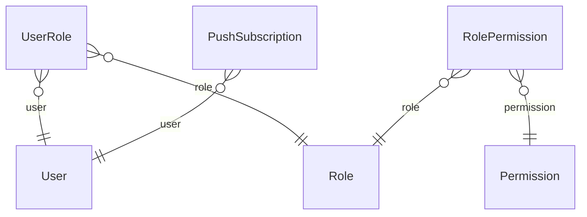

### Company

Mandant / Unternehmen

| Feld | Typ | Standard | Bedeutung |
|---|---|---|---|
| `id` | String | UUID | Schlüssel |
| `name` | String |  |  |
| `financeDefaultsAt` | DateTime? |  | Startkategorien und -regeln der Finanzen angelegt (einmalig) |
| `street` | String? |  | Pflichtangaben für Rechnungen (§ 14 UStG): Anschrift und Steuernummer oder USt-IdNr. Ohne sie lässt sich keine Rechnung ausstellen. |
| `postalCode` | String? |  |  |
| `city` | String? |  |  |
| `taxNumber` | String? |  | Steuernummer vom Finanzamt |
| `vatId` | String? |  | USt-IdNr., z.B. DE123456789 |
| `createdAt` | DateTime | jetzt |  |
| `email` | String? |  | Zusätzlich für die E-Rechnung (XRechnung): Kontakt und Bankverbindung |
| `phone` | String? |  |  |
| `contactName` | String? |  | Ansprechpartner; ohne Angabe der Firmenname |
| `iban` | String? |  |  |
| `bic` | String? |  |  |
| `paymentTermDays` | Int | 14 | Zahlungsziel in Tagen |
| `smallBusiness` | Boolean | false | Kleinunternehmer nach § 19 UStG: Angebote und Rechnungen ohne Umsatzsteuer |
| `hourlyLaborRate` | Decimal | 45 | Konfigurierbare Kalkulationsgrundlagen (Punkt 20: keine starre, fest eingebaute Marge). Werden vom Calculations-Modul genutzt und können pro Anfrage überschrieben werden (siehe CalculateServiceDto). |
| `overheadPercent` | Decimal | 15 |  |
| `defaultSurchargePercent` | Decimal | 20 |  |
| `regularDailyHours` | Decimal | 8 | Grundlage für die Überstundenberechnung (Punkt 29: "später Arbeitszeitmodelle, Zuschläge"). Bewusst einfach gehalten: eine Regelarbeitszeit pro Tag statt komplexer Schichtmodelle – siehe STATUS.md. |
| `overtimeSurchargePercent` | Decimal | 25 |  |
| `timeZone` | String | Europe/Berlin | IANA-Zeitzone für Tagesgrenzen (Mein Tag, Überstunden, Terminkollision) |
| `defaultVatRate` | Decimal | 19 | Standard-Umsatzsteuersatz für neue Angebote (Prozent) |
| `datevConsultantNumber` | Int? |  | DATEV-Export (Buchungsstapel für den Steuerberater) Beraternummer |
| `datevClientNumber` | Int? |  | Mandantennummer |
| `datevChartOfAccounts` | [DatevChart](#enum-datevchart) | SKR03 |  |
| `datevRevenueAccounts` | Json? |  | Abweichende Erlöskonten: {"standard19": 8400, "standard7": 8300, "smallBusiness": 8195, "reverseCharge": 8337}; fehlende Einträge = Standard |
| `dunningDeadlineDays` | Int | 7 | Mahnwesen: neue Zahlungsfrist in Tagen ab dem Mahndatum |
| `dunningFee1` | Decimal | 0 | Mahngebühren je Stufe (Zahlungserinnerung, 1., 2. Mahnung), 0 = keine |
| `dunningFee2` | Decimal | 0 |  |
| `dunningFee3` | Decimal | 0 |  |
| `dunningInterest` | Boolean | false | Verzugszinsen nach § 288 BGB (aus bis eingeschaltet); Basiszinssatz der Bundesbank, ändert sich zum 1.1. und 1.7. |
| `baseInterestRate` | Decimal? |  |  |
| `dunningLumpSum` | Boolean | false | Pauschale 40 € bei Geschäftskunden (§ 288 Abs. 5 BGB) |
| `quantityDecimals` | Int | 2 | Rundung der Mengen auf Angeboten und Rechnungen (Standard; Einheit, Leistung/Artikel und Position können abweichen, siehe common/units.ts) |
| `quantityRounding` | [QuantityRounding](#enum-quantityrounding) | half_up |  |

**Verwendet von:** `User.companyId`, `Role.companyId`, `Customer.companyId`, `Property.companyId`, `Project.companyId`, `Quote.companyId`, `Order.companyId`, `Article.companyId`, `Service.companyId`, `Supplier.companyId`, `Machine.companyId`, `Appointment.companyId`, `MaintenanceContract.companyId`, `ContractTask.companyId`, `Employee.companyId`, `TimeEntry.companyId`, `Document.companyId`, `ProjectMaterialUsage.companyId`, `AuditLog.companyId`, `NumberSequence.companyId`, `ImportSession.companyId`, `Absence.companyId`, `PushSubscription.companyId`, `AiProviderConfig.companyId`, `AiTaskAssignment.companyId`, `ProjectMessage.companyId`, `ProjectMessageRead.companyId`, `OcrJob.companyId`, `Invoice.companyId`, `InvoicePayment.companyId`, `DunningNotice.companyId`, `InvoiceFile.companyId`, `InvoiceChargeWaiver.companyId`, `BankTransaction.companyId`, `UnitSetting.companyId`, `ExpenseCategory.companyId`, `CategoryRule.companyId`, `RecurringPayment.companyId`, `BankBalance.companyId`, `IncomingInvoice.companyId`, `SitePlan.companyId`, `PlanServiceMapping.companyId`, `SiteDiaryEntry.companyId`, `CalendarEvent.companyId`, `Equipment.companyId`, `EquipmentDamage.companyId`, `EquipmentMaintenance.companyId`, `EquipmentMaintenanceLog.companyId`, `InventoryCount.companyId`, `InventoryCountItem.companyId`, `ChecklistTemplate.companyId`, `Checklist.companyId`, `ChecklistItem.companyId`, `ChecklistComment.companyId`, `BusinessContract.companyId`, `DeliveryNote.companyId`

### User

Benutzer / Rollen / Rechte

| Feld | Typ | Standard | Bedeutung |
|---|---|---|---|
| `id` | String | UUID | Schlüssel |
| `companyId` | String |  |  |
| `email` | String |  | eindeutig |
| `passwordHash` | String |  |  |
| `firstName` | String |  |  |
| `lastName` | String |  |  |
| `active` | Boolean | true |  |
| `tokenVersion` | Int | 0 | Wird bei Passwortänderung und Deaktivierung erhöht – alle vorher ausgestellten Tokens werden damit sofort ungültig. |
| `createdAt` | DateTime | jetzt |  |
| `anonymizedAt` | DateTime? |  | Datenschutz: auf Anfrage anonymisiert (E-Mail, Name entfernt, gesperrt) |

**Verweist auf**

- `companyId` → [Company](#company) (n:1, Pflicht)

**Verwendet von:** `UserRole.userId`, `Appointment.assignedUserId`, `ContractTask.assignedUserId`, `Employee.userId`, `Document.uploadedByUserId`, `Absence.userId`, `PushSubscription.userId`, `ProjectMessage.authorUserId`, `ProjectMessageRead.userId`, `CalendarEvent.ownerUserId`

### Role

| Feld | Typ | Standard | Bedeutung |
|---|---|---|---|
| `id` | String | UUID | Schlüssel |
| `companyId` | String |  |  |
| `name` | String |  | frei definierbar, keine Hardcoded-Rollen |
| `isSystem` | Boolean | false | z.B. Startvorlagen |

**Verweist auf**

- `companyId` → [Company](#company) (n:1, Pflicht)

**Verwendet von:** `UserRole.roleId`, `RolePermission.roleId`

**Eindeutig:** (companyId, name)

### UserRole

| Feld | Typ | Standard | Bedeutung |
|---|---|---|---|
| `userId` | String |  |  |
| `roleId` | String |  |  |

**Verweist auf**

- `userId` → [User](#user) (n:1, Pflicht)
- `roleId` → [Role](#role) (n:1, Pflicht)

**Mandanten-Schutz (Trigger):** `roleId` → Role gehören zur selben Firma

### Permission

Feste, im Code bekannte Permission-Keys (siehe src/common/permissions.ts)

| Feld | Typ | Standard | Bedeutung |
|---|---|---|---|
| `id` | String | UUID | Schlüssel |
| `key` | String |  | eindeutig – z.B. "price.purchase.read" |
| `label` | String |  |  |

**Verwendet von:** `RolePermission.permissionId`

### RolePermission

| Feld | Typ | Standard | Bedeutung |
|---|---|---|---|
| `roleId` | String |  |  |
| `permissionId` | String |  |  |

**Verweist auf**

- `roleId` → [Role](#role) (n:1, Pflicht)
- `permissionId` → [Permission](#permission) (n:1, Pflicht)

### PushSubscription

Push-Nachrichten (Web Push): ein Eintrag je Gerät/Browser eines Nutzers. Die Schlüssel des Servers (VAPID) erzeugt GartenAI beim ersten Bedarf selbst und legt sie verschlüsselt in AppSecret ab.

| Feld | Typ | Standard | Bedeutung |
|---|---|---|---|
| `id` | String | UUID | Schlüssel |
| `companyId` | String |  |  |
| `userId` | String |  |  |
| `endpoint` | String |  | eindeutig |
| `p256dh` | String |  |  |
| `auth` | String |  |  |
| `userAgent` | String? |  |  |
| `createdAt` | DateTime | jetzt |  |
| `lastSentAt` | DateTime? |  |  |

**Verweist auf**

- `companyId` → [Company](#company) (n:1, Pflicht)
- `userId` → [User](#user) (n:1, Pflicht)

**Mandanten-Schutz (Trigger):** `userId` → User gehören zur selben Firma

## Kunden und Projekte

Kunde → Objekt (Adresse) → Projekt. Fast alles Weitere hängt an einem Projekt.

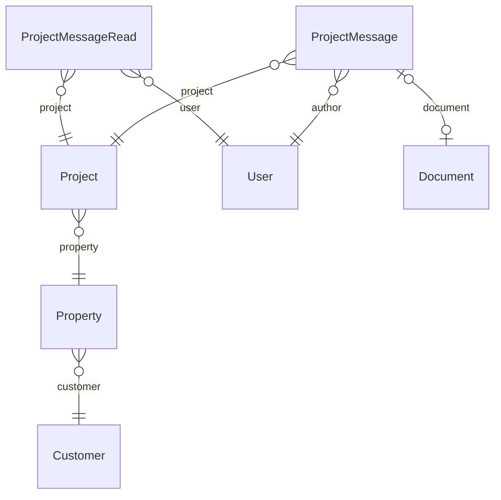

### Customer

Kunde → Objekt → Projekt

| Feld | Typ | Standard | Bedeutung |
|---|---|---|---|
| `id` | String | UUID | Schlüssel |
| `companyId` | String |  |  |
| `name` | String |  |  |
| `email` | String? |  |  |
| `phone` | String? |  |  |
| `street` | String? |  | Rechnungsanschrift; fehlt sie, wird die Anschrift des Objekts verwendet. |
| `postalCode` | String? |  |  |
| `city` | String? |  |  |
| `buyerReference` | String? |  | Käuferreferenz der E-Rechnung, bei öffentlichen Auftraggebern die Leitweg-ID |
| `vatId` | String? |  | USt-IdNr. des Kunden – nötig für E-Rechnungen nach § 13b UStG |
| `isBusiness` | Boolean | false | Unternehmer statt Verbraucher: höherer Verzugszins, Verzugspauschale |
| `debtorNumber` | Int? |  | Debitorenkonto in der Buchhaltung (DATEV: 10000–69999), fortlaufend |
| `createdAt` | DateTime | jetzt |  |
| `anonymizedAt` | DateTime? |  | Datenschutz: auf Anfrage anonymisiert (Name und Kontakt entfernt; Rechnungen behalten ihre Kopie der Anschrift wegen der Aufbewahrungspflicht) |

**Verweist auf**

- `companyId` → [Company](#company) (n:1, Pflicht)

**Verwendet von:** `Property.customerId`

**Eindeutig:** (companyId, debtorNumber)

### Property

| Feld | Typ | Standard | Bedeutung |
|---|---|---|---|
| `id` | String | UUID | Schlüssel |
| `companyId` | String |  |  |
| `customerId` | String |  |  |
| `label` | String |  | z.B. "Hauptwohnsitz", "Ferienhaus Garten" |
| `street` | String? |  |  |
| `postalCode` | String? |  |  |
| `city` | String? |  |  |

**Verweist auf**

- `companyId` → [Company](#company) (n:1, Pflicht)
- `customerId` → [Customer](#customer) (n:1, Pflicht)

**Verwendet von:** `Project.propertyId`

**Mandanten-Schutz (Trigger):** `customerId` → Customer gehören zur selben Firma

### Project

| Feld | Typ | Standard | Bedeutung |
|---|---|---|---|
| `id` | String | UUID | Schlüssel |
| `companyId` | String |  |  |
| `propertyId` | String |  |  |
| `title` | String |  |  |
| `number` | String? |  | Projektnummer (P-2026-0012) – für Lieferanten, Lieferscheine, Rechnungen |
| `status` | [ProjectStatus](#enum-projectstatus) | open |  |
| `createdAt` | DateTime | jetzt |  |

**Verweist auf**

- `companyId` → [Company](#company) (n:1, Pflicht)
- `propertyId` → [Property](#property) (n:1, Pflicht)

**Verwendet von:** `Quote.projectId`, `Order.projectId`, `Appointment.projectId`, `MaintenanceContract.projectId`, `TimeEntry.projectId`, `Document.projectId`, `ProjectMaterialUsage.projectId`, `ProjectMessage.projectId`, `ProjectMessageRead.projectId`, `Invoice.projectId`, `IncomingInvoice.projectId`, `SitePlan.projectId`, `SiteDiaryEntry.projectId`, `Checklist.projectId`, `DeliveryNote.projectId`

**Eindeutig:** (companyId, number)

**Mandanten-Schutz (Trigger):** `propertyId` → Property gehören zur selben Firma

### ProjectMessage

Baustelle: Nachrichten zwischen Büro und Baustelle je Projekt, optional mit Foto (Document, documentType "photo")

| Feld | Typ | Standard | Bedeutung |
|---|---|---|---|
| `id` | String | UUID | Schlüssel |
| `companyId` | String |  |  |
| `projectId` | String |  |  |
| `authorUserId` | String |  |  |
| `text` | String? |  |  |
| `documentId` | String? |  | eindeutig |
| `clientId` | String? |  | vom Gerät vergeben: aus der Offline-Warteschlange nur einmal angelegt |
| `createdAt` | DateTime | jetzt |  |

**Verweist auf**

- `companyId` → [Company](#company) (n:1, Pflicht)
- `projectId` → [Project](#project) (n:1, Pflicht)
- `authorUserId` → [User](#user) (n:1, Pflicht)
- `documentId` → [Document](#document) (1:1, optional, beim Löschen: SetNull)

**Eindeutig:** (companyId, clientId)

**Mandanten-Schutz (Trigger):** `projectId` → Project, `authorUserId` → User, `documentId` → Document gehören zur selben Firma

### ProjectMessageRead

bis wann ein Nutzer die Nachrichten eines Projekts gelesen hat

| Feld | Typ | Standard | Bedeutung |
|---|---|---|---|
| `id` | String | UUID | Schlüssel |
| `companyId` | String |  |  |
| `projectId` | String |  |  |
| `userId` | String |  |  |
| `lastReadAt` | DateTime |  |  |

**Verweist auf**

- `companyId` → [Company](#company) (n:1, Pflicht)
- `projectId` → [Project](#project) (n:1, Pflicht)
- `userId` → [User](#user) (n:1, Pflicht)

**Eindeutig:** (projectId, userId)

**Mandanten-Schutz (Trigger):** `projectId` → Project, `userId` → User gehören zur selben Firma

## Stammdaten

Artikel, Leistungen mit Rezeptur (ServiceComponent: Artikel oder Maschine je Einheit), Lieferanten, Maschinen, Einheiten.

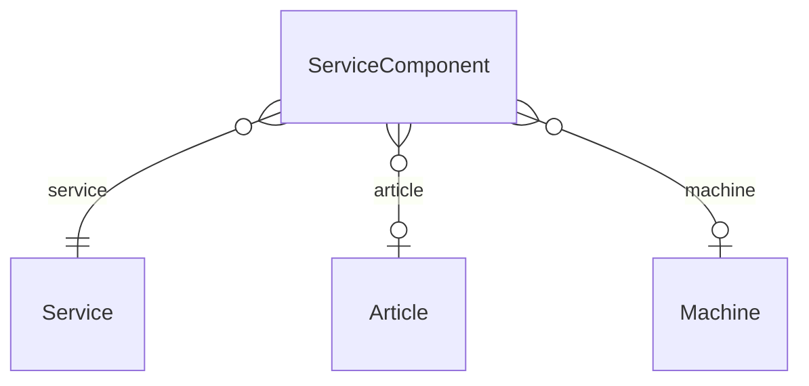

### Article

Stammdaten: Artikel & Dienstleistungen (Rezepturen)

| Feld | Typ | Standard | Bedeutung |
|---|---|---|---|
| `id` | String | UUID | Schlüssel |
| `companyId` | String |  |  |
| `articleNumber` | String |  |  |
| `name` | String |  |  |
| `unit` | String |  | z.B. "m²", "Stk", "kg" |
| `purchasePrice` | Decimal |  |  |
| `quantityDecimals` | Int? |  | Rundung der Mengen für diesen Artikel (leer = aus Einheit bzw. Firma) |
| `quantityRounding` | [QuantityRounding](#enum-quantityrounding)? |  |  |
| `quantityStep` | Decimal? |  |  |
| `salePrice` | Decimal |  |  |
| `active` | Boolean | true |  |

**Verweist auf**

- `companyId` → [Company](#company) (n:1, Pflicht)

**Verwendet von:** `ServiceComponent.articleId`, `ProjectMaterialUsage.articleId`

**Eindeutig:** (companyId, articleNumber)

### Service

| Feld | Typ | Standard | Bedeutung |
|---|---|---|---|
| `id` | String | UUID | Schlüssel |
| `companyId` | String |  |  |
| `name` | String |  | z.B. "1 m² Terrasse verlegen" |
| `unit` | String |  |  |
| `quantityDecimals` | Int? |  | Rundung der Mengen für diese Leistung (leer = aus Einheit bzw. Firma) |
| `quantityRounding` | [QuantityRounding](#enum-quantityrounding)? |  |  |
| `quantityStep` | Decimal? |  |  |

**Verweist auf**

- `companyId` → [Company](#company) (n:1, Pflicht)

**Verwendet von:** `ServiceComponent.serviceId`, `PlanServiceMapping.serviceId`

### ServiceComponent

| Feld | Typ | Standard | Bedeutung |
|---|---|---|---|
| `id` | String | UUID | Schlüssel |
| `serviceId` | String |  |  |
| `articleId` | String? |  |  |
| `quantityPer` | Decimal |  | Menge pro Einheit der Leistung |
| `laborMinutes` | Int? |  | alternative: Arbeitszeit-Anteil |
| `machineId` | String? |  | Maschineneinsatz je Einheit (z.B. 6 Min. Rüttelplatte je m²) |
| `machineMinutes` | Int? |  |  |

**Verweist auf**

- `serviceId` → [Service](#service) (n:1, Pflicht)
- `articleId` → [Article](#article) (n:1, optional)
- `machineId` → [Machine](#machine) (n:1, optional)

**Mandanten-Schutz (Trigger):** `articleId` → Article, `machineId` → Machine gehören zur selben Firma

### Supplier

Weitere Stammdaten: Lieferanten & Maschinen (Punkt 18)

| Feld | Typ | Standard | Bedeutung |
|---|---|---|---|
| `id` | String | UUID | Schlüssel |
| `companyId` | String |  |  |
| `name` | String |  |  |
| `email` | String? |  |  |
| `phone` | String? |  |  |
| `active` | Boolean | true |  |
| `customerNumber` | String? |  | unsere Kundennummer beim Lieferanten (für Bestellungen und Mails) |
| `matchTerms` | String[] | [] | weitere Wörter, an denen Lieferscheine des Lieferanten erkannt werden (z.B. Firmierung, Ort, USt-IdNr.) |

**Verweist auf**

- `companyId` → [Company](#company) (n:1, Pflicht)

**Verwendet von:** `IncomingInvoice.supplierId`, `DeliveryNote.supplierId`

### Machine

| Feld | Typ | Standard | Bedeutung |
|---|---|---|---|
| `id` | String | UUID | Schlüssel |
| `companyId` | String |  |  |
| `name` | String |  |  |
| `hourlyRate` | Decimal |  | Maschinenkosten pro Stunde |
| `active` | Boolean | true |  |

**Verweist auf**

- `companyId` → [Company](#company) (n:1, Pflicht)

**Verwendet von:** `ServiceComponent.machineId`, `Equipment.machineId`

### UnitSetting

Einstellungen je Einheit: Rundung für Katalog-Einheiten anpassen oder eigene Einheiten anlegen (dann mit Bezeichnung)

| Feld | Typ | Standard | Bedeutung |
|---|---|---|---|
| `id` | String | UUID | Schlüssel |
| `companyId` | String |  |  |
| `code` | String |  | Katalog-Code ("m²") oder eigene Einheit ("Rolle") |
| `label` | String? |  |  |
| `decimals` | Int? |  |  |
| `rounding` | [QuantityRounding](#enum-quantityrounding)? |  |  |
| `step` | Decimal? |  |  |
| `createdAt` | DateTime | jetzt |  |

**Verweist auf**

- `companyId` → [Company](#company) (n:1, Pflicht)

**Eindeutig:** (companyId, code)

**Mandanten-Schutz (Trigger):** nur companyId gehören zur selben Firma

### ImportSession

Eingelesene Quelle des Stammdaten-Imports bis zur Übernahme (höchstens einen Tag): Vorschau und Übernahme arbeiten mit derselben Tabelle, ohne dass der Browser die Daten erneut schickt

| Feld | Typ | Standard | Bedeutung |
|---|---|---|---|
| `id` | String | UUID | Schlüssel |
| `companyId` | String |  |  |
| `userId` | String |  |  |
| `source` | String |  |  |
| `headers` | Json |  |  |
| `rows` | Json |  |  |
| `createdAt` | DateTime | jetzt |  |

**Verweist auf**

- `companyId` → [Company](#company) (n:1, Pflicht)

**Mandanten-Schutz (Trigger):** nur companyId gehören zur selben Firma

## Angebote und Aufträge

Angebotspositionen speichern Preise als Kopie (Snapshot); ein Auftrag entsteht aus genau einem angenommenen Angebot.

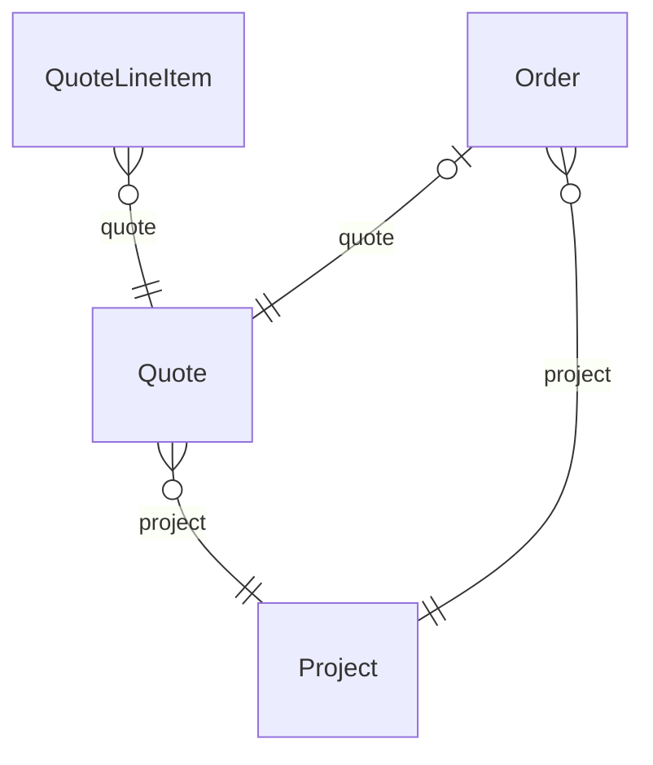

### Quote

Angebote (Punkt 21): Preise werden als SNAPSHOT gespeichert. Eine spätere Änderung von Article.salePrice darf ein bestehendes Angebot NICHT verändern – deshalb liegen unitPrice/costPerUnit/margin direkt auf QuoteLineItem und werden nie live nachberechnet.

| Feld | Typ | Standard | Bedeutung |
|---|---|---|---|
| `id` | String | UUID | Schlüssel |
| `companyId` | String |  |  |
| `projectId` | String |  |  |
| `status` | [QuoteStatus](#enum-quotestatus) | draft |  |
| `number` | String? |  | Fortlaufende Nummer je Firma und Jahr, z.B. A-2026-0001 |
| `totalNet` | Decimal |  |  |
| `vatRate` | Decimal | 19 |  |
| `vatTreatment` | [VatTreatment](#enum-vattreatment) | standard |  |
| `totalVat` | Decimal | 0 |  |
| `totalGross` | Decimal | 0 |  |
| `validUntil` | DateTime? |  |  |
| `introText` | String? |  | Anschreiben über den Positionen (PDF); nur im Entwurf änderbar |
| `gaebInfo` | Json? |  | aus einem GAEB-Leistungsverzeichnis eingelesen: Projekt, LV-Name und Gliederung (BoQBkdn) für die Angebotsabgabe als X84 (quotes/gaeb) |
| `createdAt` | DateTime | jetzt |  |

**Verweist auf**

- `companyId` → [Company](#company) (n:1, Pflicht)
- `projectId` → [Project](#project) (n:1, Pflicht)

**Verwendet von:** `QuoteLineItem.quoteId`, `Order.quoteId`

**Eindeutig:** (companyId, number)

**Mandanten-Schutz (Trigger):** `projectId` → Project gehören zur selben Firma

### QuoteLineItem

| Feld | Typ | Standard | Bedeutung |
|---|---|---|---|
| `id` | String | UUID | Schlüssel |
| `quoteId` | String |  |  |
| `position` | Int | 0 | Reihenfolge im Angebot (1, 2, 3 …) – ohne sie liefert die Datenbank die Positionen in beliebiger Reihenfolge |
| `serviceId` | String? |  | nur Referenz/Nachvollziehbarkeit, keine Live-Daten; null = freie Position |
| `description` | String |  | Snapshot des Leistungsnamens zum Zeitpunkt der Erstellung |
| `unit` | String |  |  |
| `gaebOz` | String? |  | Ordnungszahl im GAEB-Leistungsverzeichnis, z.B. "01.02.0030" |
| `quantity` | Decimal |  | gerundete Menge (Angebot, PDF, Summe); die genaue Menge bleibt für die Nachkalkulation erhalten |
| `quantityExact` | Decimal? |  |  |
| `roundingDecimals` | Int? |  | Rundung nur für diese Position (sonst Leistung → Einheit → Firma) |
| `roundingMode` | [QuantityRounding](#enum-quantityrounding)? |  |  |
| `roundingStep` | Decimal? |  |  |
| `roundingSource` | String? |  | woher die angewandte Rundung kam: position, master, unit, company |
| `costPerUnit` | Decimal |  | Preis-Snapshot – ab hier ändert sich nichts mehr rückwirkend: |
| `unitPrice` | Decimal |  | = salePricePerUnit zum Zeitpunkt X |
| `marginPerUnit` | Decimal |  |  |
| `lineTotal` | Decimal |  |  |
| `plannedLaborMinutesPerUnit` | Int? |  | Soll-Werte für die Nachkalkulation, eingefroren wie der Preis. Ohne sie würde eine spätere Rezepturänderung den Soll-Ist-Vergleich verfälschen. null bei Positionen, die vor Einführung dieser Felder entstanden sind. |
| `plannedMaterialCostPerUnit` | Decimal? |  |  |

**Verweist auf**

- `quoteId` → [Quote](#quote) (n:1, Pflicht)

**Mandanten-Schutz (Trigger):** `serviceId` → Service gehören zur selben Firma

### Order

Auftrag (Punkt 22): entsteht aus einem angenommenen Angebot. Ein Angebot kann höchstens einen Auftrag erzeugen (quoteId @unique) – verhindert doppelte Auftragserzeugung aus demselben Angebot.

| Feld | Typ | Standard | Bedeutung |
|---|---|---|---|
| `id` | String | UUID | Schlüssel |
| `companyId` | String |  |  |
| `projectId` | String |  |  |
| `quoteId` | String |  | eindeutig |
| `status` | [OrderStatus](#enum-orderstatus) | open |  |
| `totalNet` | Decimal |  | vom Angebot übernommener Snapshot |
| `createdAt` | DateTime | jetzt |  |

**Verweist auf**

- `companyId` → [Company](#company) (n:1, Pflicht)
- `projectId` → [Project](#project) (n:1, Pflicht)
- `quoteId` → [Quote](#quote) (1:1, Pflicht)

**Verwendet von:** `Invoice.orderId`

**Mandanten-Schutz (Trigger):** `projectId` → Project, `quoteId` → Quote gehören zur selben Firma

## Pflege- und Wartungsverträge

Wiederkehrende Einsätze werden zu Terminen, die Vergütung je Zeitraum zu Rechnungen.

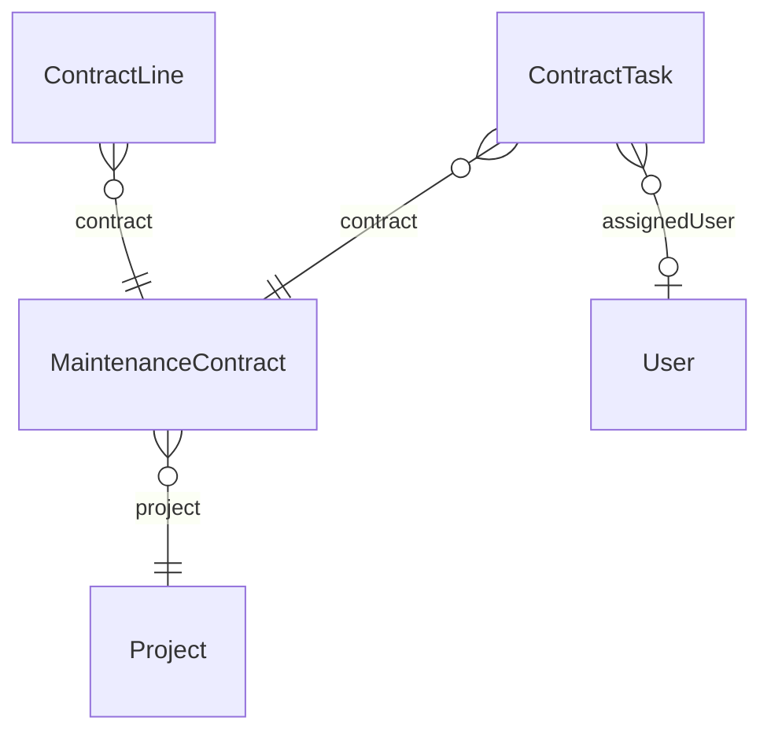

### MaintenanceContract

| Feld | Typ | Standard | Bedeutung |
|---|---|---|---|
| `id` | String | UUID | Schlüssel |
| `companyId` | String |  |  |
| `projectId` | String |  |  |
| `title` | String |  |  |
| `status` | [ContractStatus](#enum-contractstatus) | active |  |
| `startDate` | DateTime |  |  |
| `endDate` | DateTime? |  |  |
| `billingInterval` | [RecurringInterval](#enum-recurringinterval) | monthly |  |
| `billInAdvance` | Boolean | true | true: zu Beginn des Zeitraums abrechnen, false: nach dessen Ende |
| `vatRate` | Decimal |  |  |
| `vatTreatment` | [VatTreatment](#enum-vattreatment) | standard |  |
| `notes` | String? |  |  |
| `createdAt` | DateTime | jetzt |  |
| `updatedAt` | DateTime | bei Änderung |  |

**Verweist auf**

- `companyId` → [Company](#company) (n:1, Pflicht)
- `projectId` → [Project](#project) (n:1, Pflicht)

**Verwendet von:** `ContractLine.contractId`, `ContractTask.contractId`, `Invoice.contractId`

**Mandanten-Schutz (Trigger):** `projectId` → Project gehören zur selben Firma

### ContractLine

Vergütung je Abrechnungszeitraum (Positionen der Rechnung)

| Feld | Typ | Standard | Bedeutung |
|---|---|---|---|
| `id` | String | UUID | Schlüssel |
| `contractId` | String |  |  |
| `position` | Int |  |  |
| `description` | String |  |  |
| `unit` | String |  |  |
| `quantity` | Decimal |  |  |
| `unitPrice` | Decimal |  |  |

**Verweist auf**

- `contractId` → [MaintenanceContract](#maintenancecontract) (n:1, Pflicht, beim Löschen: Cascade)

**Mandanten-Schutz (Trigger):** nur companyId gehören zur selben Firma

### ContractTask

Wiederkehrender Einsatz, z.B. "Rasen mähen" alle 2 Wochen von April bis Oktober

| Feld | Typ | Standard | Bedeutung |
|---|---|---|---|
| `id` | String | UUID | Schlüssel |
| `companyId` | String |  |  |
| `contractId` | String |  |  |
| `title` | String |  |  |
| `everyWeeks` | Int |  |  |
| `seasonFrom` | Int | 1 | Saison als Monate 1–12; seasonFrom > seasonTo läuft über den Jahreswechsel |
| `seasonTo` | Int | 12 |  |
| `startMinutes` | Int | 480 | Uhrzeit (Minuten nach Mitternacht, Ortszeit) und Dauer der Termine |
| `durationMinutes` | Int | 120 |  |
| `assignedUserId` | String? |  |  |
| `nextDue` | DateTime |  | nächster noch nicht geplanter Termin |

**Verweist auf**

- `companyId` → [Company](#company) (n:1, Pflicht)
- `contractId` → [MaintenanceContract](#maintenancecontract) (n:1, Pflicht, beim Löschen: Cascade)
- `assignedUserId` → [User](#user) (n:1, optional)

**Verwendet von:** `Appointment.contractTaskId`

**Mandanten-Schutz (Trigger):** `contractId` → MaintenanceContract, `assignedUserId` → User gehören zur selben Firma

## Planung, Team und Zeiten

Termine, Abwesenheiten, Kalender, Mitarbeiter (getrennt von Nutzern), Zeiten und Materialverbrauch.

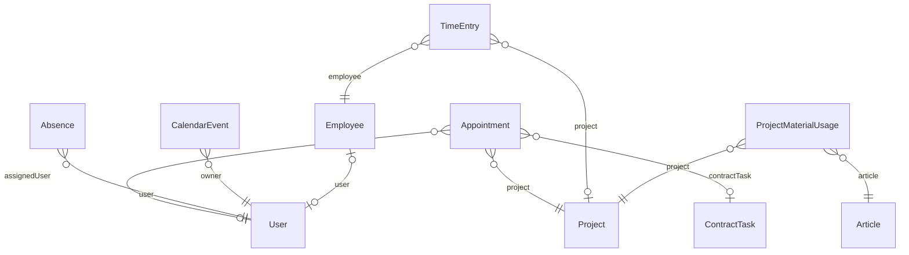

### Appointment

Termine / "Mein Tag" (Punkt 23 & 24 im Ursprungsdokument)

| Feld | Typ | Standard | Bedeutung |
|---|---|---|---|
| `id` | String | UUID | Schlüssel |
| `companyId` | String |  |  |
| `projectId` | String |  |  |
| `title` | String |  |  |
| `startTime` | DateTime |  |  |
| `endTime` | DateTime? |  |  |
| `assignedUserId` | String? |  |  |
| `notes` | String? |  |  |
| `status` | [AppointmentStatus](#enum-appointmentstatus) | planned |  |
| `contractTaskId` | String? |  | aus einem Pflegevertrag geplant |
| `createdAt` | DateTime | jetzt |  |

**Verweist auf**

- `companyId` → [Company](#company) (n:1, Pflicht)
- `projectId` → [Project](#project) (n:1, Pflicht)
- `assignedUserId` → [User](#user) (n:1, optional)
- `contractTaskId` → [ContractTask](#contracttask) (n:1, optional, beim Löschen: SetNull)

**Mandanten-Schutz (Trigger):** `projectId` → Project, `assignedUserId` → User, `contractTaskId` → ContractTask gehören zur selben Firma

### Absence

Abwesenheiten (Urlaub, Krankheit, Schulung) je Nutzer – ganze Kalendertage. Die Plantafel zeigt sie, Termine lassen sich an diesen Tagen nicht zuteilen. Die Art sieht nur, wer Mitarbeiterdaten sehen darf (Krankheit ist ein Gesundheitsdatum), alle anderen nur „abwesend“.

| Feld | Typ | Standard | Bedeutung |
|---|---|---|---|
| `id` | String | UUID | Schlüssel |
| `companyId` | String |  |  |
| `userId` | String |  |  |
| `kind` | [AbsenceKind](#enum-absencekind) |  |  |
| `startDate` | DateTime |  |  |
| `endDate` | DateTime |  |  |
| `note` | String? |  |  |
| `createdByUserId` | String |  |  |
| `createdAt` | DateTime | jetzt |  |

**Verweist auf**

- `companyId` → [Company](#company) (n:1, Pflicht)
- `userId` → [User](#user) (n:1, Pflicht)

**Mandanten-Schutz (Trigger):** `userId` → User, `createdByUserId` → User gehören zur selben Firma

### CalendarEvent

Kalender: Firmen-Termine (alle sehen sie, z.B. Betriebsurlaub, Schulung) und persönliche Termine (nur der Besitzer). Baustellen- und Teamtermine kommen aus Appointment, Abwesenheiten aus Absence.

| Feld | Typ | Standard | Bedeutung |
|---|---|---|---|
| `id` | String | UUID | Schlüssel |
| `companyId` | String |  |  |
| `scope` | [CalendarScope](#enum-calendarscope) |  |  |
| `ownerUserId` | String |  |  |
| `title` | String |  |  |
| `startTime` | DateTime |  |  |
| `endTime` | DateTime? |  |  |
| `allDay` | Boolean | false |  |
| `notes` | String? |  |  |
| `createdAt` | DateTime | jetzt |  |

**Verweist auf**

- `companyId` → [Company](#company) (n:1, Pflicht)
- `ownerUserId` → [User](#user) (n:1, Pflicht)

**Mandanten-Schutz (Trigger):** `ownerUserId` → User gehören zur selben Firma

### Employee

Mitarbeiter & Zeiterfassung (Punkt 12 & 29 im Ursprungsdokument) Mitarbeiter ist bewusst von User getrennt: nicht jeder Mitarbeiter braucht einen Login-Account (z.B. Saisonkräfte ohne App-Zugang).

| Feld | Typ | Standard | Bedeutung |
|---|---|---|---|
| `id` | String | UUID | Schlüssel |
| `companyId` | String |  |  |
| `userId` | String? |  | eindeutig – optionale Verknüpfung zu einem Login-Account |
| `firstName` | String |  |  |
| `lastName` | String |  |  |
| `active` | Boolean | true |  |

**Verweist auf**

- `companyId` → [Company](#company) (n:1, Pflicht)
- `userId` → [User](#user) (1:1, optional)

**Verwendet von:** `TimeEntry.employeeId`

**Mandanten-Schutz (Trigger):** `userId` → User gehören zur selben Firma

### TimeEntry

| Feld | Typ | Standard | Bedeutung |
|---|---|---|---|
| `id` | String | UUID | Schlüssel |
| `companyId` | String |  |  |
| `employeeId` | String |  |  |
| `projectId` | String? |  |  |
| `startTime` | DateTime |  |  |
| `endTime` | DateTime? |  |  |
| `breakMinutes` | Int | 0 |  |
| `activity` | String? |  |  |
| `status` | [TimeEntryStatus](#enum-timeentrystatus) | open | open = läuft noch |
| `approvedByUserId` | String? |  | Wer hat wann freigegeben (freigegebene Einträge sind gesperrt) |
| `approvedAt` | DateTime? |  |  |
| `createdAt` | DateTime | jetzt |  |

**Verweist auf**

- `companyId` → [Company](#company) (n:1, Pflicht)
- `employeeId` → [Employee](#employee) (n:1, Pflicht)
- `projectId` → [Project](#project) (n:1, optional)

**Mandanten-Schutz (Trigger):** `employeeId` → Employee, `projectId` → Project gehören zur selben Firma

### ProjectMaterialUsage

Materialverbrauch (Punkt 27: Baustellendokumentation; Punkt 28: Nachkalkulation braucht Ist-Material neben Ist-Arbeitszeit).

| Feld | Typ | Standard | Bedeutung |
|---|---|---|---|
| `id` | String | UUID | Schlüssel |
| `companyId` | String |  |  |
| `projectId` | String |  |  |
| `articleId` | String |  |  |
| `quantity` | Decimal |  |  |
| `recordedByUserId` | String? |  |  |
| `createdAt` | DateTime | jetzt |  |

**Verweist auf**

- `companyId` → [Company](#company) (n:1, Pflicht)
- `projectId` → [Project](#project) (n:1, Pflicht)
- `articleId` → [Article](#article) (n:1, Pflicht)

**Mandanten-Schutz (Trigger):** `projectId` → Project, `articleId` → Article gehören zur selben Firma

## Baustelle: Lagepläne, Bautagebuch, Checklisten

Alles, was auf der Baustelle am Projekt entsteht.

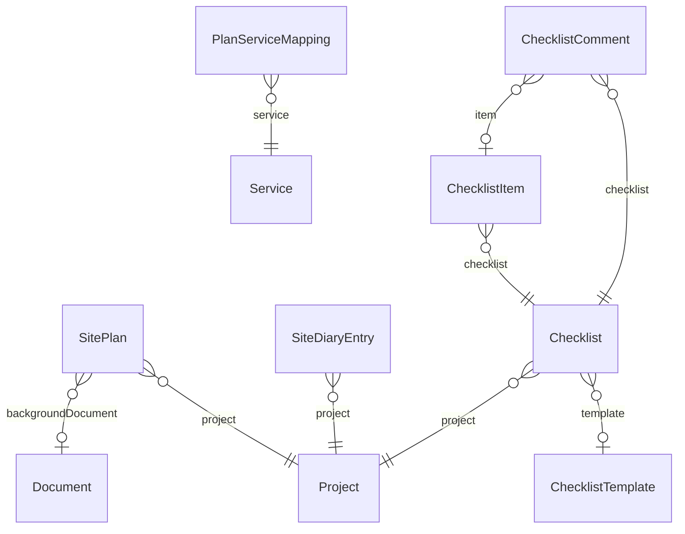

### SitePlan

Lageplan am Projekt: Entwässerung, Leitungen, Flächen, Zäune/Tore/Türen, Symbole. Objekte als JSON in Planeinheiten (bei Hintergrundbild dessen Pixel), Maßstab unitsPerMeter. version schützt gegen gegenseitiges Überschreiben beim gleichzeitigen Bearbeiten.

| Feld | Typ | Standard | Bedeutung |
|---|---|---|---|
| `id` | String | UUID | Schlüssel |
| `companyId` | String |  |  |
| `projectId` | String |  |  |
| `name` | String |  |  |
| `unitsPerMeter` | Float | 50 |  |
| `backgroundDocumentId` | String? |  |  |
| `backgroundWidth` | Int? |  |  |
| `backgroundHeight` | Int? |  |  |
| `objects` | Json | [] |  |
| `version` | Int | 1 |  |
| `createdAt` | DateTime | jetzt |  |
| `updatedAt` | DateTime | bei Änderung |  |

**Verweist auf**

- `companyId` → [Company](#company) (n:1, Pflicht)
- `projectId` → [Project](#project) (n:1, Pflicht)
- `backgroundDocumentId` → [Document](#document) (n:1, optional, beim Löschen: SetNull)

**Mandanten-Schutz (Trigger):** `projectId` → Project, `backgroundDocumentId` → Document gehören zur selben Firma

### PlanServiceMapping

Welche Leistung zu einer Menge aus dem Lageplan gehört (z.B. "lawn" -> "Rasen anlegen", "lawn:mowingEdge" -> "Mähkante setzen"); je Firma, gemerkt beim Übernehmen ins Angebot

| Feld | Typ | Standard | Bedeutung |
|---|---|---|---|
| `id` | String | UUID | Schlüssel |
| `companyId` | String |  |  |
| `quantityKey` | String |  |  |
| `serviceId` | String |  |  |

**Verweist auf**

- `companyId` → [Company](#company) (n:1, Pflicht)
- `serviceId` → [Service](#service) (n:1, Pflicht, beim Löschen: Cascade)

**Eindeutig:** (companyId, quantityKey)

**Mandanten-Schutz (Trigger):** `serviceId` → Service gehören zur selben Firma

### SiteDiaryEntry

Bautagebuch: je Projekt und Tag ein Eintrag (Wetter, Besetzung, Arbeiten, Verzögerungen/Behinderungen). Jede Änderung steht im Audit-Log.

| Feld | Typ | Standard | Bedeutung |
|---|---|---|---|
| `id` | String | UUID | Schlüssel |
| `companyId` | String |  |  |
| `projectId` | String |  |  |
| `day` | DateTime |  |  |
| `weather` | [DiaryWeather](#enum-diaryweather)? |  |  |
| `temperature` | Int? |  |  |
| `crew` | String? |  |  |
| `crewCount` | Int? |  |  |
| `work` | String? |  |  |
| `delayHours` | Decimal? |  | Verzögerung/Behinderung: Stunden, Ursache, Beschreibung |
| `delayReason` | [DiaryDelayReason](#enum-diarydelayreason)? |  |  |
| `delayNote` | String? |  |  |
| `notes` | String? |  |  |
| `createdByUserId` | String |  |  |
| `updatedByUserId` | String |  |  |
| `createdAt` | DateTime | jetzt |  |
| `updatedAt` | DateTime | bei Änderung |  |

**Verweist auf**

- `companyId` → [Company](#company) (n:1, Pflicht)
- `projectId` → [Project](#project) (n:1, Pflicht)

**Eindeutig:** (projectId, day)

**Mandanten-Schutz (Trigger):** `projectId` → Project, `createdByUserId` → User, `updatedByUserId` → User gehören zur selben Firma

### ChecklistTemplate

Checklisten mit Vorlagen (Rolle Einsatzplaner) Vorlage: vom Einsatzplaner angelegt (freigegeben) oder aus einer Baustellen- Liste vorgeschlagen und vom Einsatzplaner geprüft. Nur freigegebene Vorlagen lassen sich für neue Listen nutzen.

| Feld | Typ | Standard | Bedeutung |
|---|---|---|---|
| `id` | String | UUID | Schlüssel |
| `companyId` | String |  |  |
| `title` | String |  |  |
| `description` | String? |  |  |
| `items` | Json |  | Punkte der Vorlage in Reihenfolge (Liste von Texten) |
| `status` | [TemplateStatus](#enum-templatestatus) |  |  |
| `proposedByUserId` | String? |  |  |
| `reviewedByUserId` | String? |  |  |
| `reviewedAt` | DateTime? |  |  |
| `reviewNote` | String? |  |  |
| `createdAt` | DateTime | jetzt |  |
| `updatedAt` | DateTime | bei Änderung |  |

**Verweist auf**

- `companyId` → [Company](#company) (n:1, Pflicht)

**Verwendet von:** `Checklist.templateId`

**Mandanten-Schutz (Trigger):** `proposedByUserId` → User, `reviewedByUserId` → User gehören zur selben Firma

### Checklist

Liste am Projekt: anlegen nur Einsatzplaner, erweitern, abhaken und kommentieren alle auf der Baustelle

| Feld | Typ | Standard | Bedeutung |
|---|---|---|---|
| `id` | String | UUID | Schlüssel |
| `companyId` | String |  |  |
| `projectId` | String |  |  |
| `title` | String |  |  |
| `templateId` | String? |  |  |
| `createdByUserId` | String |  |  |
| `createdAt` | DateTime | jetzt |  |

**Verweist auf**

- `companyId` → [Company](#company) (n:1, Pflicht)
- `projectId` → [Project](#project) (n:1, Pflicht)
- `templateId` → [ChecklistTemplate](#checklisttemplate) (n:1, optional)

**Verwendet von:** `ChecklistItem.checklistId`, `ChecklistComment.checklistId`

**Mandanten-Schutz (Trigger):** `projectId` → Project, `templateId` → ChecklistTemplate, `createdByUserId` → User gehören zur selben Firma

### ChecklistItem

| Feld | Typ | Standard | Bedeutung |
|---|---|---|---|
| `id` | String | UUID | Schlüssel |
| `companyId` | String |  |  |
| `checklistId` | String |  |  |
| `text` | String |  |  |
| `position` | Int |  |  |
| `addedByUserId` | String |  |  |
| `doneAt` | DateTime? |  |  |
| `doneByUserId` | String? |  |  |
| `createdAt` | DateTime | jetzt |  |

**Verweist auf**

- `companyId` → [Company](#company) (n:1, Pflicht)
- `checklistId` → [Checklist](#checklist) (n:1, Pflicht, beim Löschen: Cascade)

**Verwendet von:** `ChecklistComment.itemId`

**Mandanten-Schutz (Trigger):** `checklistId` → Checklist, `addedByUserId` → User, `doneByUserId` → User gehören zur selben Firma

### ChecklistComment

| Feld | Typ | Standard | Bedeutung |
|---|---|---|---|
| `id` | String | UUID | Schlüssel |
| `companyId` | String |  |  |
| `checklistId` | String |  |  |
| `itemId` | String? |  |  |
| `userId` | String |  |  |
| `text` | String |  |  |
| `createdAt` | DateTime | jetzt |  |

**Verweist auf**

- `companyId` → [Company](#company) (n:1, Pflicht)
- `checklistId` → [Checklist](#checklist) (n:1, Pflicht, beim Löschen: Cascade)
- `itemId` → [ChecklistItem](#checklistitem) (n:1, optional, beim Löschen: Cascade)

**Mandanten-Schutz (Trigger):** `checklistId` → Checklist, `itemId` → ChecklistItem, `userId` → User gehören zur selben Firma

## Rechnungen, Zahlungen, Mahnungen

Ab „issued“ ist eine Rechnung unveränderlich; Korrekturen laufen über Storno bzw. neue Belege.

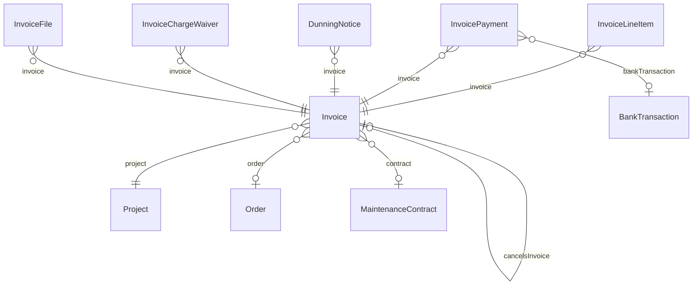

### Invoice

| Feld | Typ | Standard | Bedeutung |
|---|---|---|---|
| `id` | String | UUID | Schlüssel |
| `companyId` | String |  |  |
| `projectId` | String |  |  |
| `orderId` | String? |  | Grundlage: ein Auftrag oder ein Pflegevertrag (genau eins von beiden) |
| `contractId` | String? |  |  |
| `kind` | [InvoiceKind](#enum-invoicekind) |  |  |
| `status` | [InvoiceStatus](#enum-invoicestatus) | draft |  |
| `number` | String? |  | R-2026-0001, erst beim Ausstellen |
| `issueDate` | DateTime? |  |  |
| `servicePeriodStart` | DateTime? |  | Leistungszeitraum (§ 14 UStG); ohne Angabe gilt das Rechnungsdatum |
| `servicePeriodEnd` | DateTime? |  |  |
| `vatRate` | Decimal |  |  |
| `vatTreatment` | [VatTreatment](#enum-vattreatment) | standard |  |
| `totalNet` | Decimal |  |  |
| `totalVat` | Decimal |  |  |
| `totalGross` | Decimal |  |  |
| `sellerSnapshot` | Json? |  | Rechnungssteller und -empfänger zum Zeitpunkt der Ausstellung, damit eine spätere Adressänderung die Rechnung nicht verändert. |
| `buyerSnapshot` | Json? |  |  |
| `cancelsInvoiceId` | String? |  | eindeutig – Stornorechnung -> die aufgehobene Rechnung |
| `createdAt` | DateTime | jetzt |  |

**Verweist auf**

- `companyId` → [Company](#company) (n:1, Pflicht)
- `projectId` → [Project](#project) (n:1, Pflicht)
- `orderId` → [Order](#order) (n:1, optional, beim Löschen: Restrict)
- `contractId` → [MaintenanceContract](#maintenancecontract) (n:1, optional, beim Löschen: Restrict)
- `cancelsInvoiceId` → [Invoice](#invoice) (1:1, optional)

**Verwendet von:** `Invoice.cancelsInvoiceId`, `InvoiceLineItem.invoiceId`, `InvoicePayment.invoiceId`, `DunningNotice.invoiceId`, `InvoiceFile.invoiceId`, `InvoiceChargeWaiver.invoiceId`

**Eindeutig:** (companyId, number)

**Mandanten-Schutz (Trigger):** `projectId` → Project, `orderId` → Order, `contractId` → MaintenanceContract, `cancelsInvoiceId` → Invoice gehören zur selben Firma

### InvoiceLineItem

| Feld | Typ | Standard | Bedeutung |
|---|---|---|---|
| `id` | String | UUID | Schlüssel |
| `invoiceId` | String |  |  |
| `position` | Int |  |  |
| `description` | String |  |  |
| `unit` | String |  |  |
| `quantity` | Decimal |  |  |
| `unitPrice` | Decimal |  |  |
| `lineTotal` | Decimal |  |  |

**Verweist auf**

- `invoiceId` → [Invoice](#invoice) (n:1, Pflicht, beim Löschen: Cascade)

### InvoicePayment

Zahlungseingang zu einer ausgestellten Rechnung. Die Rechnung selbst bleibt unverändert (GoBD); offen ist Bruttobetrag minus Summe der Zahlungen. Korrekturen durch Löschen der Zahlung (im Audit-Log festgehalten).

| Feld | Typ | Standard | Bedeutung |
|---|---|---|---|
| `id` | String | UUID | Schlüssel |
| `companyId` | String |  |  |
| `invoiceId` | String |  |  |
| `amount` | Decimal |  |  |
| `costsAmount` | Decimal | 0 | davon auf Mahnkosten (Gebühren, Pauschale) und Verzugszinsen verrechnet (§ 367 BGB: erst Kosten, dann Zinsen, dann Rechnungsbetrag) |
| `interestAmount` | Decimal | 0 |  |
| `paidOn` | DateTime |  |  |
| `method` | [PaymentMethod](#enum-paymentmethod) | bank |  |
| `note` | String? |  |  |
| `bankTransactionId` | String? |  | gebucht aus dem Bankabgleich |
| `createdByUserId` | String? |  |  |
| `createdAt` | DateTime | jetzt |  |

**Verweist auf**

- `companyId` → [Company](#company) (n:1, Pflicht)
- `invoiceId` → [Invoice](#invoice) (n:1, Pflicht)
- `bankTransactionId` → [BankTransaction](#banktransaction) (n:1, optional)

**Mandanten-Schutz (Trigger):** `invoiceId` → Invoice, `bankTransactionId` → BankTransaction gehören zur selben Firma

### DunningNotice

Mahnung zu einer überfälligen Rechnung: Stufe 1 = Zahlungserinnerung, 2 = 1. Mahnung, 3 = 2. Mahnung. Offener Betrag und Frist werden beim Erstellen festgehalten (das PDF zeigt immer den Stand von damals).

| Feld | Typ | Standard | Bedeutung |
|---|---|---|---|
| `id` | String | UUID | Schlüssel |
| `companyId` | String |  |  |
| `invoiceId` | String |  |  |
| `level` | Int |  |  |
| `issuedOn` | DateTime |  |  |
| `deadline` | DateTime |  |  |
| `openAmount` | Decimal |  |  |
| `fee` | Decimal | 0 | Forderungen neben der Rechnung (siehe invoices/dunning-charges.ts) |
| `interest` | Decimal | 0 |  |
| `interestRate` | Decimal? |  |  |
| `interestFrom` | DateTime? |  |  |
| `lumpSum` | Decimal | 0 |  |
| `createdByUserId` | String? |  |  |
| `sentAt` | DateTime? |  |  |
| `sentTo` | String? |  |  |
| `createdAt` | DateTime | jetzt |  |

**Verweist auf**

- `companyId` → [Company](#company) (n:1, Pflicht)
- `invoiceId` → [Invoice](#invoice) (n:1, Pflicht)

**Eindeutig:** (invoiceId, level)

**Mandanten-Schutz (Trigger):** `invoiceId` → Invoice gehören zur selben Firma

### InvoiceChargeWaiver

Erlassene Mahnkosten und Zinsen (die Rechnung selbst bleibt unverändert)

| Feld | Typ | Standard | Bedeutung |
|---|---|---|---|
| `id` | String | UUID | Schlüssel |
| `companyId` | String |  |  |
| `invoiceId` | String |  |  |
| `amount` | Decimal |  |  |
| `reason` | String? |  |  |
| `createdByUserId` | String? |  |  |
| `createdAt` | DateTime | jetzt |  |

**Verweist auf**

- `companyId` → [Company](#company) (n:1, Pflicht)
- `invoiceId` → [Invoice](#invoice) (n:1, Pflicht)

**Mandanten-Schutz (Trigger):** `invoiceId` → Invoice gehören zur selben Firma

### InvoiceFile

Archiv der ausgestellten Rechnung (GoBD): PDF und E-Rechnung werden einmal beim Ausstellen erzeugt und danach unverändert ausgeliefert und versendet. Datenbank-Trigger: weder änderbar noch löschbar.

| Feld | Typ | Standard | Bedeutung |
|---|---|---|---|
| `id` | String | UUID | Schlüssel |
| `companyId` | String |  |  |
| `invoiceId` | String |  |  |
| `kind` | [InvoiceFileKind](#enum-invoicefilekind) |  |  |
| `fileName` | String |  |  |
| `storagePath` | String |  |  |
| `sha256` | String |  | Prüfsumme des Inhalts, zum Nachweis der Unverändertheit |
| `size` | Int |  |  |
| `createdAt` | DateTime | jetzt |  |

**Verweist auf**

- `companyId` → [Company](#company) (n:1, Pflicht)
- `invoiceId` → [Invoice](#invoice) (n:1, Pflicht)

**Eindeutig:** (invoiceId, kind)

**Mandanten-Schutz (Trigger):** `invoiceId` → Invoice gehören zur selben Firma

### NumberSequence

Zähler für fortlaufende Belegnummern (Angebote, später Rechnungen) je Firma, Belegart und Jahr. Wird per INSERT ... ON CONFLICT atomar erhöht.

| Feld | Typ | Standard | Bedeutung |
|---|---|---|---|
| `companyId` | String |  |  |
| `kind` | String |  | "quote", später "invoice" |
| `year` | Int |  |  |
| `lastValue` | Int | 0 |  |

**Verweist auf**

- `companyId` → [Company](#company) (n:1, Pflicht)

## Bank und Finanzen

Kontoauszüge, Kontostände, Ausgabenkategorien mit Regeln, Fixkosten, Versicherungen und Verträge.

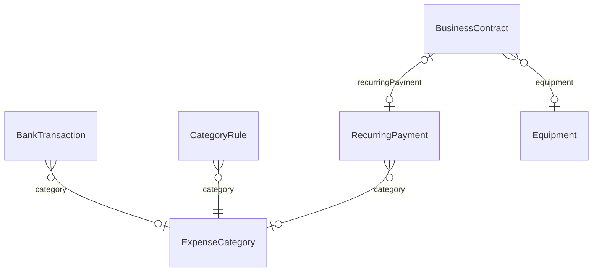

### BankTransaction

Zahlungseingang vom Kontoauszug (CAMT.053). Erst nach Bestätigung wird daraus eine Zahlung zur Rechnung (paymentId). dedupeKey verhindert, dass ein erneut eingelesener Auszug Umsätze doppelt anlegt.

| Feld | Typ | Standard | Bedeutung |
|---|---|---|---|
| `id` | String | UUID | Schlüssel |
| `companyId` | String |  |  |
| `dedupeKey` | String |  |  |
| `accountIban` | String? |  |  |
| `bookingDate` | DateTime |  |  |
| `amount` | Decimal |  | immer positiv; Gutschrift (Zahlungseingang) oder Abbuchung |
| `direction` | [BankDirection](#enum-bankdirection) | credit |  |
| `reversal` | Boolean | false | Rückbuchung: nicht im Bankabgleich, im Finanzbereich gekennzeichnet |
| `counterpartyName` | String? |  | Zahler bei Gutschriften, Empfänger bei Abbuchungen |
| `counterpartyIban` | String? |  |  |
| `remittance` | String? |  |  |
| `status` | [BankTransactionStatus](#enum-banktransactionstatus) | open | Bankabgleich (Zuordnung zu Rechnungen) nur für Gutschriften |
| `categoryId` | String? |  | Kategorie (Ausgaben): per Regel, gelernt oder von Hand zugeordnet |
| `categorySource` | [CategorySource](#enum-categorysource)? |  |  |
| `categorizedAt` | DateTime? |  |  |
| `createdByUserId` | String? |  |  |
| `createdAt` | DateTime | jetzt |  |

**Verweist auf**

- `companyId` → [Company](#company) (n:1, Pflicht)
- `categoryId` → [ExpenseCategory](#expensecategory) (n:1, optional, beim Löschen: SetNull)

**Verwendet von:** `InvoicePayment.bankTransactionId`, `IncomingInvoice.bankTransactionId`

**Eindeutig:** (companyId, dedupeKey)

**Mandanten-Schutz (Trigger):** `categoryId` → ExpenseCategory gehören zur selben Firma

### BankBalance

Gebuchter Kontostand (Schlusssaldo) je Konto und Tag, aus dem Kontoauszug

| Feld | Typ | Standard | Bedeutung |
|---|---|---|---|
| `id` | String | UUID | Schlüssel |
| `companyId` | String |  |  |
| `accountIban` | String |  |  |
| `date` | DateTime |  |  |
| `amount` | Decimal |  | negativ bei Soll-Saldo |
| `createdAt` | DateTime | jetzt |  |

**Verweist auf**

- `companyId` → [Company](#company) (n:1, Pflicht)

**Eindeutig:** (companyId, accountIban, date)

**Mandanten-Schutz (Trigger):** nur companyId gehören zur selben Firma

### ExpenseCategory

Kategorien für Ausgaben (Finanzbereich)

| Feld | Typ | Standard | Bedeutung |
|---|---|---|---|
| `id` | String | UUID | Schlüssel |
| `companyId` | String |  |  |
| `name` | String |  |  |
| `sortOrder` | Int | 0 |  |
| `createdAt` | DateTime | jetzt |  |

**Verweist auf**

- `companyId` → [Company](#company) (n:1, Pflicht)

**Verwendet von:** `BankTransaction.categoryId`, `CategoryRule.categoryId`, `RecurringPayment.categoryId`, `IncomingInvoice.categoryId`

**Eindeutig:** (companyId, name)

**Mandanten-Schutz (Trigger):** nur companyId gehören zur selben Firma

### CategoryRule

Stichwort-Regel: enthält Empfänger/Verwendungszweck das Muster (bzw. ist die IBAN gleich), wird die Kategorie vorgeschlagen

| Feld | Typ | Standard | Bedeutung |
|---|---|---|---|
| `id` | String | UUID | Schlüssel |
| `companyId` | String |  |  |
| `categoryId` | String |  |  |
| `pattern` | String |  |  |
| `field` | [CategoryRuleField](#enum-categoryrulefield) | any |  |
| `createdAt` | DateTime | jetzt |  |

**Verweist auf**

- `companyId` → [Company](#company) (n:1, Pflicht)
- `categoryId` → [ExpenseCategory](#expensecategory) (n:1, Pflicht, beim Löschen: Cascade)

**Mandanten-Schutz (Trigger):** `categoryId` → ExpenseCategory gehören zur selben Firma

### RecurringPayment

Wiederkehrende Ausgabe (Fixkosten): Miete, Leasing, Versicherung …

| Feld | Typ | Standard | Bedeutung |
|---|---|---|---|
| `id` | String | UUID | Schlüssel |
| `companyId` | String |  |  |
| `name` | String |  |  |
| `counterpartyName` | String? |  |  |
| `counterpartyIban` | String? |  |  |
| `amount` | Decimal |  |  |
| `interval` | [RecurringInterval](#enum-recurringinterval) |  |  |
| `nextDue` | DateTime |  | nächste Fälligkeit (Stichtag für den Rhythmus) |
| `endDate` | DateTime? |  |  |
| `categoryId` | String? |  |  |
| `active` | Boolean | true |  |
| `createdAt` | DateTime | jetzt |  |

**Verweist auf**

- `companyId` → [Company](#company) (n:1, Pflicht)
- `categoryId` → [ExpenseCategory](#expensecategory) (n:1, optional, beim Löschen: SetNull)

**Verwendet von:** `BusinessContract.recurringPaymentId`

**Mandanten-Schutz (Trigger):** `categoryId` → ExpenseCategory gehören zur selben Firma

### BusinessContract

Versicherungen und Verträge (Finanzen) Laufzeit, Verlängerung und Kündigungsfrist; daraus ergibt sich "kündigen bis spätestens". Der Beitrag kann als Fixkosten (RecurringPayment) mitlaufen.

| Feld | Typ | Standard | Bedeutung |
|---|---|---|---|
| `id` | String | UUID | Schlüssel |
| `companyId` | String |  |  |
| `name` | String |  |  |
| `kind` | [BusinessContractKind](#enum-businesscontractkind) |  |  |
| `provider` | String? |  |  |
| `contractNumber` | String? |  |  |
| `amount` | Decimal? |  |  |
| `interval` | [RecurringInterval](#enum-recurringinterval)? |  |  |
| `startDate` | DateTime? |  |  |
| `termEnd` | DateTime? |  | Ende der laufenden Laufzeit; leer = unbefristet |
| `renewalMonths` | Int? |  | automatische Verlängerung um n Monate (leer = endet einfach) |
| `noticeMonths` | Int | 3 |  |
| `cancelledOn` | DateTime? |  |  |
| `equipmentId` | String? |  |  |
| `recurringPaymentId` | String? |  | eindeutig |
| `notes` | String? |  |  |
| `createdAt` | DateTime | jetzt |  |
| `updatedAt` | DateTime | bei Änderung |  |

**Verweist auf**

- `companyId` → [Company](#company) (n:1, Pflicht)
- `equipmentId` → [Equipment](#equipment) (n:1, optional, beim Löschen: SetNull)
- `recurringPaymentId` → [RecurringPayment](#recurringpayment) (1:1, optional, beim Löschen: SetNull)

**Mandanten-Schutz (Trigger):** `equipmentId` → Equipment, `recurringPaymentId` → RecurringPayment gehören zur selben Firma

## Einkauf

Eingangsrechnungen und Lieferscheine; beide lassen sich einem Projekt und einander zuordnen.

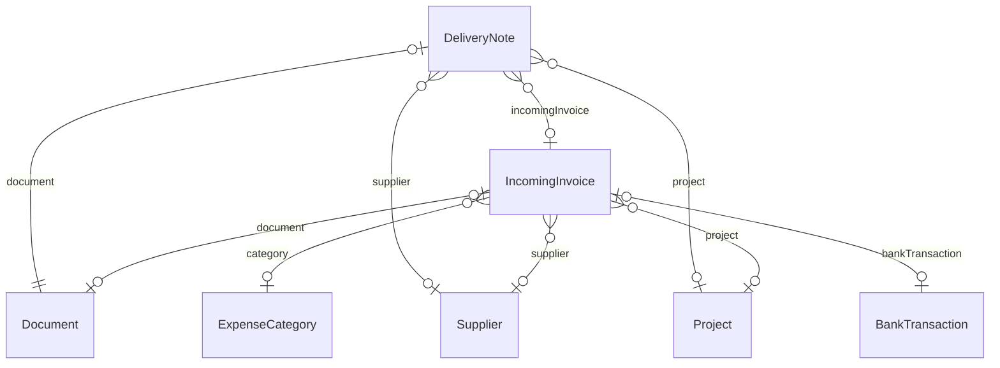

### IncomingInvoice

| Feld | Typ | Standard | Bedeutung |
|---|---|---|---|
| `id` | String | UUID | Schlüssel |
| `companyId` | String |  |  |
| `supplierName` | String |  |  |
| `supplierIban` | String? |  |  |
| `invoiceNumber` | String? |  |  |
| `invoiceDate` | DateTime? |  |  |
| `dueDate` | DateTime? |  |  |
| `amount` | Decimal |  | brutto, zu zahlen |
| `netAmount` | Decimal? |  |  |
| `vatAmount` | Decimal? |  |  |
| `discountPercent` | Decimal? |  | Skonto |
| `discountUntil` | DateTime? |  |  |
| `categoryId` | String? |  |  |
| `documentId` | String? |  | eindeutig |
| `source` | [PayableSource](#enum-payablesource) | manual |  |
| `status` | [PayableStatus](#enum-payablestatus) | open |  |
| `paidAt` | DateTime? |  |  |
| `paidAmount` | Decimal? |  |  |
| `bankTransactionId` | String? |  | eindeutig |
| `supplierId` | String? |  | Lieferant aus den Stammdaten (aus dem Namen erkannt oder gewählt) |
| `projectId` | String? |  | Einkauf/Fremdleistung für ein Projekt (Nachkalkulation) |
| `rejectedTransactionIds` | String[] | [] | beim "Wieder öffnen" verworfene Abbuchungen: nicht erneut zuordnen |
| `notes` | String? |  |  |
| `createdByUserId` | String? |  |  |
| `createdAt` | DateTime | jetzt |  |
| `updatedAt` | DateTime | bei Änderung |  |

**Verweist auf**

- `companyId` → [Company](#company) (n:1, Pflicht)
- `categoryId` → [ExpenseCategory](#expensecategory) (n:1, optional, beim Löschen: SetNull)
- `documentId` → [Document](#document) (1:1, optional, beim Löschen: SetNull)
- `bankTransactionId` → [BankTransaction](#banktransaction) (1:1, optional, beim Löschen: SetNull)
- `supplierId` → [Supplier](#supplier) (n:1, optional, beim Löschen: SetNull)
- `projectId` → [Project](#project) (n:1, optional, beim Löschen: SetNull)

**Verwendet von:** `DeliveryNote.incomingInvoiceId`

**Mandanten-Schutz (Trigger):** `categoryId` → ExpenseCategory, `documentId` → Document, `bankTransactionId` → BankTransaction, `projectId` → Project, `supplierId` → Supplier gehören zur selben Firma

### DeliveryNote

Lieferscheine: aus dem erkannten Text Lieferant, Projekt, Nummer und Datum Jeder Lieferschein ist ein Dokument; GartenAI schlägt Lieferant und Projekt vor, das Büro bestätigt oder korrigiert (Eingang "Lieferscheine").

| Feld | Typ | Standard | Bedeutung |
|---|---|---|---|
| `id` | String | UUID | Schlüssel |
| `companyId` | String |  |  |
| `documentId` | String |  | eindeutig |
| `supplierId` | String? |  |  |
| `projectId` | String? |  |  |
| `noteNumber` | String? |  |  |
| `noteDate` | DateTime? |  |  |
| `status` | [DeliveryNoteStatus](#enum-deliverynotestatus) | open |  |
| `hints` | Json? |  | Woran erkannt (für die Anzeige "warum dieser Vorschlag") |
| `confirmedByUserId` | String? |  |  |
| `confirmedAt` | DateTime? |  |  |
| `incomingInvoiceId` | String? |  | abgerechnet mit dieser Eingangsrechnung |
| `createdAt` | DateTime | jetzt |  |
| `updatedAt` | DateTime | bei Änderung |  |

**Verweist auf**

- `companyId` → [Company](#company) (n:1, Pflicht)
- `documentId` → [Document](#document) (1:1, Pflicht, beim Löschen: Cascade)
- `supplierId` → [Supplier](#supplier) (n:1, optional, beim Löschen: SetNull)
- `projectId` → [Project](#project) (n:1, optional, beim Löschen: SetNull)
- `incomingInvoiceId` → [IncomingInvoice](#incominginvoice) (n:1, optional, beim Löschen: SetNull)

**Mandanten-Schutz (Trigger):** `documentId` → Document, `supplierId` → Supplier, `projectId` → Project, `confirmedByUserId` → User, `incomingInvoiceId` → IncomingInvoice gehören zur selben Firma

## Dokumente und Texterkennung

Metadaten der Dateien (Inhalt im Volume bzw. S3) und die Warteschlange der Texterkennung.

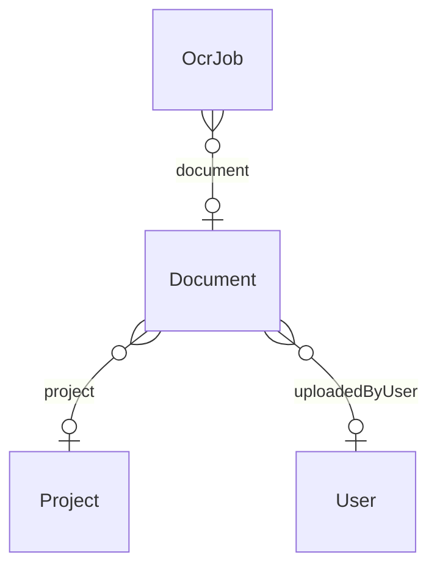

### Document

Dokumente (Punkt 6 & 15): NUR Metadaten. Der eigentliche Dateiinhalt (Foto, PDF, Plan, ...) liegt bewusst NICHT in der Datenbank, sondern in einem Objektspeicher (S3-kompatibel/MinIO o.ä.) – storagePath verweist nur dorthin. Die tatsächliche OCR-/Texterkennungs-Pipeline aus Punkt 15 ist noch nicht implementiert (siehe STATUS.md); dieses Modell legt die Grundlage (Dokumenttyp, Zuordnung zu Projekt, Hochlade-Protokoll).

| Feld | Typ | Standard | Bedeutung |
|---|---|---|---|
| `id` | String | UUID | Schlüssel |
| `companyId` | String |  |  |
| `projectId` | String? |  |  |
| `fileName` | String |  |  |
| `documentType` | String | other | invoice, quote, delivery_note, price_list, floor_plan, other, ... |
| `storagePath` | String |  | Verweis auf den Objektspeicher, KEIN Dateiinhalt |
| `uploadedByUserId` | String? |  |  |
| `createdAt` | DateTime | jetzt |  |
| `ocrStatus` | [OcrJobStatus](#enum-ocrjobstatus)? |  | Texterkennung beim Hochladen (optional): Stand und erkannter Text, durchsuchbar über GET /documents/by-project/:id?q= |
| `ocrText` | String? |  |  |

**Verweist auf**

- `companyId` → [Company](#company) (n:1, Pflicht)
- `projectId` → [Project](#project) (n:1, optional)
- `uploadedByUserId` → [User](#user) (n:1, optional)

**Verwendet von:** `ProjectMessage.documentId`, `OcrJob.documentId`, `IncomingInvoice.documentId`, `SitePlan.backgroundDocumentId`, `DeliveryNote.documentId`

**Mandanten-Schutz (Trigger):** `projectId` → Project, `uploadedByUserId` → User gehören zur selben Firma

### OcrJob

| Feld | Typ | Standard | Bedeutung |
|---|---|---|---|
| `id` | String | UUID | Schlüssel |
| `companyId` | String |  |  |
| `userId` | String? |  |  |
| `fileName` | String |  |  |
| `documentId` | String? |  | Auftrag zu einem hochgeladenen Dokument: das Ergebnis landet dort |
| `status` | [OcrJobStatus](#enum-ocrjobstatus) | queued |  |
| `worker` | String? |  | Server, der den Auftrag bearbeitet, und dessen letztes Lebenszeichen – Aufträge ohne Lebenszeichen gelten nach 2 Minuten als abgebrochen |
| `heartbeatAt` | DateTime? |  |  |
| `result` | Json? |  |  |
| `error` | String? |  |  |
| `createdAt` | DateTime | jetzt |  |
| `finishedAt` | DateTime? |  |  |

**Verweist auf**

- `companyId` → [Company](#company) (n:1, Pflicht)
- `documentId` → [Document](#document) (n:1, optional, beim Löschen: SetNull)

**Mandanten-Schutz (Trigger):** `documentId` → Document gehören zur selben Firma

### OcrSlot

| Feld | Typ | Standard | Bedeutung |
|---|---|---|---|
| `id` | Int |  | Schlüssel |
| `holder` | String? |  |  |
| `leasedUntil` | DateTime? |  |  |

## Geräte und Fahrzeuge

Geräte mit Schäden, Wartungsplänen, Wartungsprotokoll und Inventur.

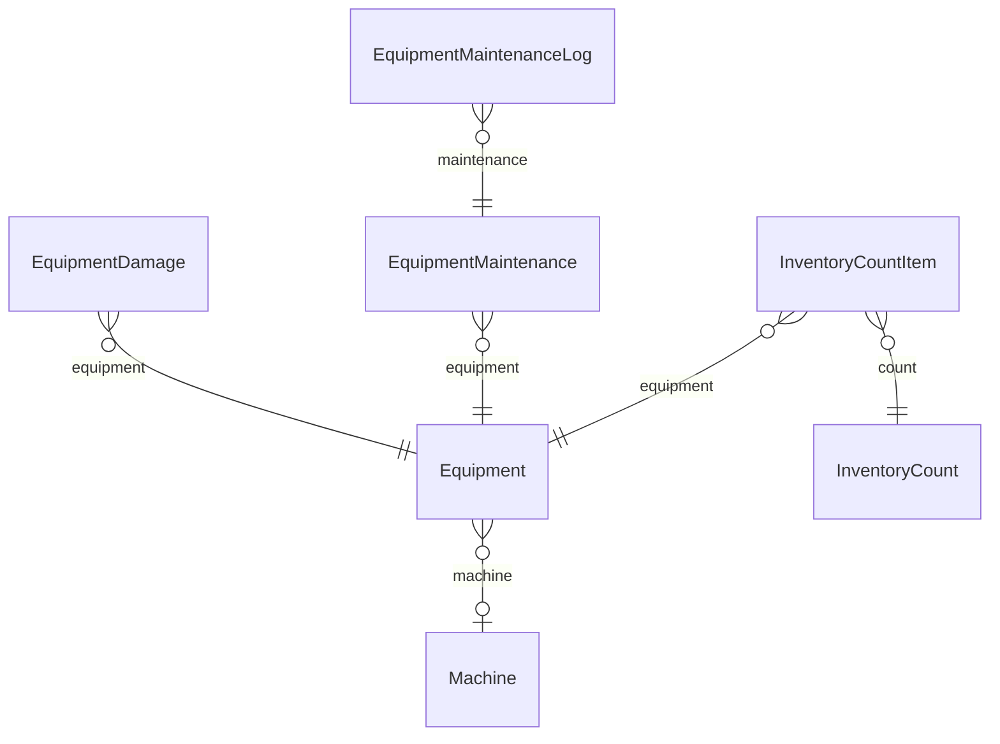

### Equipment

Geräte und Fahrzeuge: Schäden, Wartung, Inventur Jedes Gerät, Fahrzeug oder Werkzeug; optional mit der Maschine aus der Kalkulation verknüpft (Stundensatz). Der Zustand ergibt sich aus den offenen Schäden (schlimmster offener Schaden), "ausgemustert" setzt das Büro.

| Feld | Typ | Standard | Bedeutung |
|---|---|---|---|
| `id` | String | UUID | Schlüssel |
| `companyId` | String |  |  |
| `name` | String |  |  |
| `kind` | [EquipmentKind](#enum-equipmentkind) |  |  |
| `inventoryNumber` | String? |  |  |
| `licensePlate` | String? |  |  |
| `serialNumber` | String? |  |  |
| `location` | String? |  |  |
| `status` | [EquipmentStatus](#enum-equipmentstatus) | ready |  |
| `retired` | Boolean | false |  |
| `machineId` | String? |  |  |
| `notes` | String? |  |  |
| `lastInventoryAt` | DateTime? |  |  |
| `createdAt` | DateTime | jetzt |  |
| `updatedAt` | DateTime | bei Änderung |  |

**Verweist auf**

- `companyId` → [Company](#company) (n:1, Pflicht)
- `machineId` → [Machine](#machine) (n:1, optional)

**Verwendet von:** `EquipmentDamage.equipmentId`, `EquipmentMaintenance.equipmentId`, `InventoryCountItem.equipmentId`, `BusinessContract.equipmentId`

**Eindeutig:** (companyId, inventoryNumber)

**Mandanten-Schutz (Trigger):** `machineId` → Machine gehören zur selben Firma

### EquipmentDamage

Schadensmeldung – von jedem auf der Baustelle, erledigt vom Büro/Werkstatt

| Feld | Typ | Standard | Bedeutung |
|---|---|---|---|
| `id` | String | UUID | Schlüssel |
| `companyId` | String |  |  |
| `equipmentId` | String |  |  |
| `projectId` | String? |  |  |
| `reportedByUserId` | String |  |  |
| `description` | String |  |  |
| `severity` | [DamageSeverity](#enum-damageseverity) |  |  |
| `status` | [DamageStatus](#enum-damagestatus) | open |  |
| `repairCost` | Decimal? |  |  |
| `resolutionNote` | String? |  |  |
| `resolvedAt` | DateTime? |  |  |
| `resolvedByUserId` | String? |  |  |
| `createdAt` | DateTime | jetzt |  |

**Verweist auf**

- `companyId` → [Company](#company) (n:1, Pflicht)
- `equipmentId` → [Equipment](#equipment) (n:1, Pflicht)

**Mandanten-Schutz (Trigger):** `equipmentId` → Equipment, `projectId` → Project, `reportedByUserId` → User, `resolvedByUserId` → User gehören zur selben Firma

### EquipmentMaintenance

Wartung/Prüfung mit Fälligkeit (TÜV, UVV, Ölwechsel …); nach "erledigt" rückt die Fälligkeit um das Intervall weiter

| Feld | Typ | Standard | Bedeutung |
|---|---|---|---|
| `id` | String | UUID | Schlüssel |
| `companyId` | String |  |  |
| `equipmentId` | String |  |  |
| `title` | String |  |  |
| `intervalMonths` | Int? |  |  |
| `nextDue` | DateTime |  |  |
| `lastDone` | DateTime? |  |  |
| `notes` | String? |  |  |
| `active` | Boolean | true |  |
| `createdAt` | DateTime | jetzt |  |

**Verweist auf**

- `companyId` → [Company](#company) (n:1, Pflicht)
- `equipmentId` → [Equipment](#equipment) (n:1, Pflicht)

**Verwendet von:** `EquipmentMaintenanceLog.maintenanceId`

**Mandanten-Schutz (Trigger):** `equipmentId` → Equipment gehören zur selben Firma

### EquipmentMaintenanceLog

| Feld | Typ | Standard | Bedeutung |
|---|---|---|---|
| `id` | String | UUID | Schlüssel |
| `companyId` | String |  |  |
| `maintenanceId` | String |  |  |
| `doneOn` | DateTime |  |  |
| `userId` | String |  |  |
| `note` | String? |  |  |
| `cost` | Decimal? |  |  |
| `createdAt` | DateTime | jetzt |  |

**Verweist auf**

- `companyId` → [Company](#company) (n:1, Pflicht)
- `maintenanceId` → [EquipmentMaintenance](#equipmentmaintenance) (n:1, Pflicht)

**Mandanten-Schutz (Trigger):** `maintenanceId` → EquipmentMaintenance, `userId` → User gehören zur selben Firma

### InventoryCount

Inventur: ein Durchgang, in dem jedes Gerät als vorhanden/fehlend erfasst wird

| Feld | Typ | Standard | Bedeutung |
|---|---|---|---|
| `id` | String | UUID | Schlüssel |
| `companyId` | String |  |  |
| `title` | String |  |  |
| `startedByUserId` | String |  |  |
| `closedAt` | DateTime? |  |  |
| `closedByUserId` | String? |  |  |
| `createdAt` | DateTime | jetzt |  |

**Verweist auf**

- `companyId` → [Company](#company) (n:1, Pflicht)

**Verwendet von:** `InventoryCountItem.countId`

**Mandanten-Schutz (Trigger):** `startedByUserId` → User, `closedByUserId` → User gehören zur selben Firma

### InventoryCountItem

| Feld | Typ | Standard | Bedeutung |
|---|---|---|---|
| `id` | String | UUID | Schlüssel |
| `companyId` | String |  |  |
| `countId` | String |  |  |
| `equipmentId` | String |  |  |
| `found` | Boolean |  |  |
| `location` | String? |  |  |
| `note` | String? |  |  |
| `countedByUserId` | String |  |  |
| `countedAt` | DateTime | jetzt |  |

**Verweist auf**

- `companyId` → [Company](#company) (n:1, Pflicht)
- `countId` → [InventoryCount](#inventorycount) (n:1, Pflicht)
- `equipmentId` → [Equipment](#equipment) (n:1, Pflicht)

**Eindeutig:** (countId, equipmentId)

**Mandanten-Schutz (Trigger):** `countId` → InventoryCount, `equipmentId` → Equipment, `countedByUserId` → User gehören zur selben Firma

## KI

KI-Anbieter je Firma (Schlüssel verschlüsselt) und welche Aufgabe welcher Anbieter übernimmt.

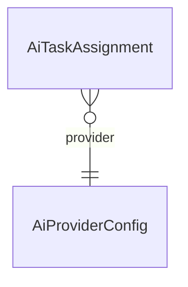

### AiProviderConfig

KI-Anbieter je Firma – bewusst offen: OpenAI-kompatible APIs (auch selbst gehostet: Ollama, LM Studio, vLLM, LocalAI), Anthropic oder ein eigener Agent über einen festen HTTP-Vertrag (siehe KI-ANBINDUNG.md). Der Schlüssel liegt verschlüsselt (AES-256-GCM, common/secret-box.ts) und verlässt den Server nie wieder.

| Feld | Typ | Standard | Bedeutung |
|---|---|---|---|
| `id` | String | UUID | Schlüssel |
| `companyId` | String |  |  |
| `name` | String |  |  |
| `kind` | [AiProviderKind](#enum-aiproviderkind) |  |  |
| `baseUrl` | String |  |  |
| `model` | String? |  |  |
| `apiKeyEncrypted` | String? |  |  |
| `enabled` | Boolean | true |  |
| `isDefault` | Boolean | false |  |
| `timeoutSeconds` | Int | 60 |  |
| `maxTokens` | Int | 1024 |  |
| `systemPrompt` | String? |  | Hinweis an das Modell, z.B. Sprache und Tonfall |
| `capabilities` | String[] | [text] | was der Anbieter kann: text, vision (Bilder verstehen), image (Bilder/Zeichnungen erzeugen) |
| `createdAt` | DateTime | jetzt |  |
| `updatedAt` | DateTime | bei Änderung |  |

**Verweist auf**

- `companyId` → [Company](#company) (n:1, Pflicht)

**Verwendet von:** `AiTaskAssignment.providerId`

### AiTaskAssignment

Welche KI-Aufgabe (ai-gateway/tasks.ts) welcher Anbieter übernimmt, auf Wunsch mit eigenem Modell; ohne Eintrag gilt der Standard-Anbieter

| Feld | Typ | Standard | Bedeutung |
|---|---|---|---|
| `id` | String | UUID | Schlüssel |
| `companyId` | String |  |  |
| `task` | String |  |  |
| `providerId` | String |  |  |
| `model` | String? |  |  |
| `updatedAt` | DateTime | bei Änderung |  |

**Verweist auf**

- `companyId` → [Company](#company) (n:1, Pflicht)
- `providerId` → [AiProviderConfig](#aiproviderconfig) (n:1, Pflicht, beim Löschen: Cascade)

**Eindeutig:** (companyId, task)

**Mandanten-Schutz (Trigger):** `providerId` → AiProviderConfig gehören zur selben Firma

## Protokoll und Betrieb

Audit-Log je Firma; firmenübergreifende Tabellen des Servers (Geheimnisse, Messwerte).

### AuditLog

Audit-Log (Punkt 36 im Ursprungsdokument)

| Feld | Typ | Standard | Bedeutung |
|---|---|---|---|
| `id` | String | UUID | Schlüssel |
| `companyId` | String |  |  |
| `userId` | String? |  |  |
| `action` | String |  |  |
| `entity` | String |  |  |
| `entityId` | String? |  |  |
| `oldData` | Json? |  |  |
| `newData` | Json? |  |  |
| `source` | String | manual | manual \| import \| ai \| system |
| `createdAt` | DateTime | jetzt |  |

**Verweist auf**

- `companyId` → [Company](#company) (n:1, Pflicht)

### AppSecret

Geheimnisse des Servers (nicht je Firma), verschlüsselt (common/secret-box.ts)

| Feld | Typ | Standard | Bedeutung |
|---|---|---|---|
| `name` | String |  | Schlüssel |
| `value` | String |  |  |
| `createdAt` | DateTime | jetzt |  |

### MetricSample

Plätze für gleichzeitige Texterkennungen über alle Server-Instanzen (OCR_CONCURRENCY). Ein Platz ist belegt, solange sein Halter ihn verlängert. Verlauf der Betriebswerte: ein Messpunkt je Minute und Server, als Grundlage für die Alarmschwellen (metrics/history). Nur Summen über alle Firmen, keine Mandantendaten; wird nach METRICS_HISTORY_DAYS gelöscht.

| Feld | Typ | Standard | Bedeutung |
|---|---|---|---|
| `id` | String | UUID | Schlüssel |
| `at` | DateTime | jetzt |  |
| `instance` | String |  |  |
| `requests` | Int |  |  |
| `serverErrors` | Int |  |  |
| `latencyBuckets` | Int[] |  | Anfragen je Dauer-Bucket (nicht kumuliert), Grenzen wie LATENCY_BUCKETS, zuletzt +Inf |
| `eventLoopP99Seconds` | Float |  |  |
| `rssBytes` | Float |  |  |
| `ocrWaiting` | Int |  |  |
| `mailFailures` | Int |  |  |

## Aufzählungen

### Enum AbsenceKind

`vacation` · `sick` · `training` · `other`

### Enum AiProviderKind

`openai_compatible` · `anthropic` · `agent`

### Enum AppointmentStatus

`planned` · `done` · `cancelled`

### Enum BankDirection

`credit` · `debit`

### Enum BankTransactionStatus

`open` · `booked` · `ignored`

### Enum BusinessContractKind

`insurance` · `vehicle` · `lease` · `rent` · `telecom` · `software` · `energy` · `service` · `other`

### Enum CalendarScope

`company` · `personal`

### Enum CategoryRuleField

`any` · `counterparty` · `remittance` · `iban`

### Enum CategorySource

`rule` · `learned` · `manual`

### Enum ContractStatus

Pflege- und Wartungsverträge: wiederkehrende Leistungen an einem Projekt (Objekt des Kunden). Die Einsätze werden als Termine geplant, die feste Vergütung wird je Abrechnungszeitraum als Rechnung (kind = periodic) erstellt. Der nächste Zeitraum ergibt sich aus den bisherigen Rechnungen.

`active` · `paused` · `ended`

### Enum DamageSeverity

`minor` · `limited` · `unusable`

### Enum DamageStatus

`open` · `in_repair` · `fixed`

### Enum DatevChart

Kontenrahmen für den DATEV-Export

`SKR03` · `SKR04`

### Enum DeliveryNoteStatus

`open` · `confirmed`

### Enum DiaryDelayReason

`weather` · `material` · `customer` · `other_trade` · `equipment` · `plans` · `staff` · `other`

### Enum DiaryWeather

`sunny` · `cloudy` · `rain` · `snow` · `frost` · `storm` · `heat`

### Enum EquipmentKind

`vehicle` · `machine` · `trailer` · `tool` · `other`

### Enum EquipmentStatus

`ready` · `limited` · `broken`

### Enum InvoiceFileKind

`pdf` · `xml`

### Enum InvoiceKind

`partial` · `final` · `cancellation` · `periodic`

### Enum InvoiceStatus

`draft` · `issued` · `cancelled`

### Enum OcrJobStatus

Umsatzsteuerliche Behandlung eines Angebots bzw. einer Rechnung Texterkennung im Hintergrund (siehe ocr/ocr-queue.ts)

`queued` · `running` · `done` · `failed`

### Enum OrderStatus

`open` · `in_progress` · `done` · `cancelled`

### Enum PayableSource

`manual` · `text` · `einvoice`

### Enum PayableStatus

Eingangsrechnungen: was die Firma selbst bezahlen muss. Erfasst aus einer E-Rechnung (XRechnung/ZUGFeRD), aus dem Text einer PDF bzw. eines Fotos oder von Hand; bezahlt per Abbuchung aus dem Kontoauszug oder von Hand.

`open` · `paid` · `cancelled`

### Enum PaymentMethod

`bank` · `cash` · `other`

### Enum ProjectStatus

`open` · `in_progress` · `done` · `cancelled`

### Enum QuantityRounding

Rundungsart der Mengen

`half_up` · `up` · `down`

### Enum QuoteStatus

`draft` · `approved` · `sent` · `accepted` · `rejected` · `expired`

### Enum RecurringInterval

`monthly` · `quarterly` · `halfyearly` · `yearly`

### Enum TemplateStatus

`proposed` · `approved` · `archived`

### Enum TimeEntryStatus

open = Zeiterfassung läuft noch

`open` · `completed` · `approved`

### Enum VatTreatment

`standard` · `small_business` · `reverse_charge`
