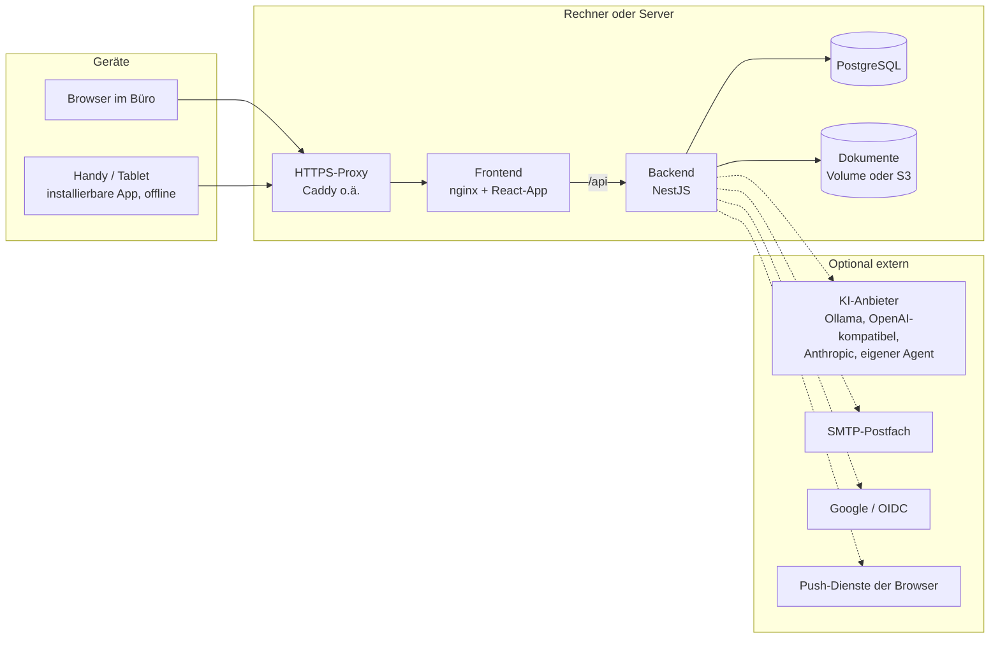

# GalaAi2.0 – GartenAI (gAla)

ERP für Garten- und Landschaftsbaubetriebe. Es bildet den ganzen Ablauf in einer Anwendung ab:
Kunde → Kalkulation → Angebot → Auftrag → Einsatzplanung → Baustelle → Rechnung → Zahlung, Mahnung,
Buchhaltung. Im Büro läuft es im Browser, auf der Baustelle als installierbare App auf dem Handy,
auch ohne Netz.

- **Zustand und Übergabe (hier anfangen):** [`UEBERGABE.md`](UEBERGABE.md)
- **Entwicklung und Test:** [`TESTANLEITUNG.md`](TESTANLEITUNG.md)
- **Betrieb auf einem eigenen Server:** [`BETRIEB.md`](BETRIEB.md), zum Ausprobieren [`SERVER-TEST.md`](SERVER-TEST.md)
- **Demo für Vorführungen (ein Laptop, Handys im WLAN):** [`DEMO.md`](DEMO.md)
- **Im Büro auf einem Rechner (echte Daten, ohne Server):** [`BUERO.md`](BUERO.md), Checkliste [`BUERO-TEST.md`](BUERO-TEST.md)
- **KI anbinden (eigene APIs, eigene Agenten, selbst gehostet):** [`KI-ANBINDUNG.md`](KI-ANBINDUNG.md)
- **Datenbank (Tabellen, Felder, Querverbindungen):** [`DATENMODELL.md`](DATENMODELL.md), **Schnittstellen und Rechte:** [`API.md`](API.md)
- **Prüfleitfaden für eine IT-Prüfung (Sicherheit, Datenschutz, Tests):** [`PRUEFUNG.md`](PRUEFUNG.md)
- **Verfahrensdokumentation nach GoBD (Entwurf für den Steuerberater):** [`VERFAHRENSDOKUMENTATION.md`](VERFAHRENSDOKUMENTATION.md)
- **Technischer Stand:** [`STATUS.md`](STATUS.md), Bewertung und Fahrplan: [`BEWERTUNG.md`](BEWERTUNG.md)
- **Ursprüngliches Konzept:** [`GartenAI-Architektur-v1.md`](GartenAI-Architektur-v1.md), Marke: [`brand/README.md`](brand/README.md)

---

## Funktionsumfang

| Bereich | Was es kann |
|---|---|
| **Kunden und Projekte** | Kunden, Objekte (Adressen), Projekte mit Nummer `P-<Jahr>-<Nr>`; Kundenverlauf mit Umsatz je Jahr und Annahmequote; Aufgaben-Übersicht und Schnellsuche |
| **Stammdaten** | Artikel, Leistungen mit Rezepturen (Material, Arbeitszeit, Maschinen), Lieferanten, Maschinen, Einheiten mit Rundung; Import aus CSV/XLSX mit Vorschau und Abgleich, Preislisten mit Änderungsvorschau |
| **Kalkulation und Angebot** | Stundensatz, Gemeinkosten und Aufschlag je Firma; Angebote mit eingefrorenen Preisen, freien Positionen, Nummernkreis, USt (auch § 19 und § 13b), PDF, Freigabe, Versand, Kopieren; GAEB X83 einlesen und X84 abgeben |
| **Aufträge und Verträge** | Auftrag aus angenommenem Angebot; Pflege- und Wartungsverträge mit Einsätzen als Termine und Abrechnung je Zeitraum |
| **Planung** | Plantafel mit Entwurfsmodus („was wäre wenn“), Kalender (Firma, Team, Baustelle, persönlich), Abwesenheiten, „Mein Tag“, Sprachbefehle |
| **Baustelle (Handy-App)** | Tagesplan, Zeit stempeln, Fotos, Nachrichten ans Büro, Push-Nachrichten; offline mit späterer Übertragung; Bautagebuch mit Behinderungen, Checklisten |
| **Lagepläne und Aufmaß** | Zeichnen mit Maßstab, Rundungen, Kreisen, Schächten; Messen, Drehen; DXF-Import; Entwässerung mit Formstücken, Höhen, Leerrohren; Mengen ins Angebot; offline |
| **Team und Zeiten** | Zeiterfassung als Selbstbedienung, Freigabe (auch gesammelt), Korrekturen mit Protokoll, Überstunden |
| **Nachkalkulation** | Soll aus dem eingefrorenen Angebot gegen Ist (Zeiten, Material, Eingangsrechnungen), Deckungsbeitrag |
| **Rechnungen** | Abschlags-, Schluss-, Storno- und Vertragsrechnung; PDF/A, XRechnung, ZUGFeRD; Versand per E-Mail; Rechnungsdatum in der Reihenfolge der Nummern |
| **Zahlungen und Mahnwesen** | Zahlungen, offene Posten, Zahlungserinnerung und Mahnungen, optional mit Gebühren, Verzugszinsen und Pauschale |
| **Bank und Finanzen** | Kontoauszüge als CAMT.053, MT940 oder CSV mit Zuordnung; Kontostände, Kategorien mit Regeln, Fixkosten, Jahresüberblick, Liquiditätsvorschau; Versicherungen und Verträge mit Kündigungsfristen |
| **Einkauf** | Eingangsrechnungen (auch als E-Rechnung) mit Belegerkennung, Zuordnung zum Projekt und Abgleich mit Lieferscheinen; Lieferscheine erkennen und zuordnen; Mail an Lieferanten |
| **Dokumente** | Upload am Projekt, Texterkennung (auch gescannte PDFs), Suche; lokal oder im S3-Objektspeicher |
| **Buchhaltung** | DATEV-Buchungsstapel (EXTF) und Debitoren-Stammdaten |
| **Geräte und Fahrzeuge** | Schäden, Wartung mit Terminen, Inventur |
| **KI (optional)** | frei wählbare Anbieter (OpenAI-kompatibel, auch selbst gehostet wie Ollama, Anthropic, eigener Agent), je Aufgabe eigenes Modell: Angebotstext, Baustellen-Zusammenfassung, Beleg lesen, Foto beschreiben, Lageplan zeichnen |
| **Verwaltung** | Rollen und Rechte, Benutzerverwaltung, Anmelden mit Google/OIDC, Audit-Log, Firmendaten, Dunkelmodus, Erscheinungsbild gAla oder GartenAI |

**Rollen** (frei anpassbar, 25 Einzelrechte):
- **Geschäftsführung:** alle Rechte.
- **Buchhaltung:** Finanzen, Rechnungen, DATEV und Verkaufspreise, keine Einkaufspreise.
- **Einsatzplaner:** wie Mitarbeiter, dazu Checklisten-Vorlagen.
- **Mitarbeiter:** Baustelle, Pläne und Kunden lesen, keine Preise und keine Finanzen.

Preise, die jemand nicht sehen darf, entfernt schon der Server aus der Antwort.

---

## Architektur



**Container:**
- **PostgreSQL**
- **Backend** (NestJS): wendet die Datenbank-Migrationen beim Start selbst an.
- **Frontend** (nginx mit der gebauten React-App): leitet `/api` an das Backend weiter, so haben App und
  Schnittstelle dieselbe Adresse.

Davor sitzt ein HTTPS-Proxy: auf dem Server ein eigener, im Büro und in der Demo Caddy mit eigener
Zertifizierungsstelle.

**Backend:** Jedes Modul hat denselben Aufbau: Controller mit Anmeldung und Rechteprüfung → Service
mit Firmenprüfung → Prisma.

| Gruppe | Module (`backend/src/…`) |
|---|---|
| Kern | `auth`, `users`, `roles`, `permissions`, `company`, `setup`, `audit-log`, `common`, `prisma`, `mail`, `pdf`, `health`, `metrics`, `logging` |
| Vertrieb | `customers`, `properties`, `projects`, `articles`, `services-catalog`, `units`, `suppliers`, `machines`, `calculations`, `quotes`, `orders`, `contracts` (Pflegeverträge) |
| Planung und Ausführung | `appointments`, `absences`, `calendar`, `employees`, `time-entries`, `material-usage`, `post-calculation`, `plans`, `site`, `site-diary`, `checklists`, `equipment`, `overview` |
| Finanzen | `invoices`, `bank`, `finance` (inkl. Eingangsrechnungen, Versicherungen und Verträge), `datev`, `delivery-notes` |
| Dokumente, Import, KI | `documents`, `ocr`, `data-guardian`, `master-data-import`, `ai-gateway`, `push`, `demo`, `demo-agent` |
| Kommandozeile | `cli/`: Firma einrichten, Demo-Daten, Demo-Agent, Dokumente in S3 umziehen, Alarmschwellen |

**Frontend:**
- React mit React Router und Vite, eigenes CSS mit Design-Tokens (hell/dunkel, zwei Erscheinungsbilder).
- Die Seiten werden nachgeladen.
- Ein Service Worker hält die App offline verfügbar. Änderungen auf der Baustelle liegen in einer
  lokalen Warteschlange (`offline/`), bis wieder Netz da ist.

**Grundsätze:**
- **Mandantentrennung dreifach:**
  - jede Tabelle mit eigener `companyId`
  - Datenbank-Trigger gegen Verknüpfungen über Firmengrenzen
  - ein Prisma-Guard, der Abfragen ohne Firmenfilter ablehnt
- **Geld und Zeit:** Geld exakt dezimal. Angebotspreise werden eingefroren. Zeitzone fest `Europe/Berlin`.
- **Sicherheit:**
  - Sitzung im httpOnly-Cookie mit CSRF-Schutz
  - Anmeldesperre je Konto und IP, Anfrage-Limit je Nutzer
  - Security-Header
  - unbekannte Felder in Anfragen werden abgelehnt
- **Geheimnisse** (KI-Schlüssel, Push-Schlüssel): AES-256-GCM-verschlüsselt in der Datenbank
  (`SECRET_KEY`).
- **Austauschbar über Schnittstellen:** KI-Anbieter, Dateispeicher (lokal/S3), Texterkennung
  (Tesseract). Die Texterkennung läuft in einer Warteschlange mit Grenze über alle Server.
- **Betrieb:**
  - Logs als JSON
  - Prometheus-Metriken mit Alarmregeln (`ops/prometheus`)
  - Sicherung/Zurückspielen mit Prüfsummen
  - Ausrollen mit automatischem Rückfall (`ops/deploy.sh`)

Ausführliche Begründungen stehen in [`STATUS.md`](STATUS.md), Abschnitt 3, und in den Nachträgen je
Ausbauschritt. Alle Tabellen mit Feldern und Beziehungen: [`DATENMODELL.md`](DATENMODELL.md) (aus dem Schema erzeugt).

---

## Betriebsarten

| | Demo | Einzelplatz (Büro) | Server |
|---|---|---|---|
| Für | Vorführung | echter Betrieb auf einem Rechner | echter Betrieb, von überall |
| Start | `ops/demo/start.*` | `ops/buero/start.*` (Windows: `start.cmd`) | `docker-compose.prod.yml`, `ops/deploy.sh` |
| Anleitung | [`DEMO.md`](DEMO.md) | [`BUERO.md`](BUERO.md) | [`BETRIEB.md`](BETRIEB.md) |

Voraussetzung ist Docker. Vom Einzelplatz geht es über die Sicherung auf den Server (`BUERO.md`,
„Später auf einen Server umziehen“).

---

## Repository

```
backend/            NestJS-Backend, prisma/ (Schema, Migrationen, Seed), test/ (Unit, Integration)
frontend/           React-App, tests/e2e (Playwright), tests/buero (Browser-Test der Büro-Installation)
ops/                Betrieb: backup.sh, restore.sh, deploy.sh, buero/, demo/, prometheus/, tests/
brand/              Logo und Markendateien
.github/workflows/  CI: Lint und Tests, E2E, Docker-Rauchtests, Server-Probe, Windows, Ausrollen
docker-compose*.yml Entwicklung (Datenbank), Demo, Büro, Produktion
```

**Schnellstart für Entwickler** (Details in [`TESTANLEITUNG.md`](TESTANLEITUNG.md)):

```bash
docker compose up -d                       # PostgreSQL
cd backend && cp .env.example .env && npm install && npx prisma migrate deploy && npx prisma db seed && npm run start:dev
cd frontend && cp .env.example .env && npm install && npm run dev  # http://localhost:5173
# Anmeldung: admin@musterbetrieb.de / demo12345
```

**Tests:**
- Backend: `npm test` (Unit) und `npm run test:integration` (gegen PostgreSQL).
- Frontend: `npm test` (Unit) und `npm run test:e2e` (Playwright).
- Die CI führt all das bei jedem Push aus. Dazu kommen:
  - E-Rechnungs- und PDF/A-Prüfung
  - Rauchtests aller Betriebsarten
  - Sicherung und Zurückspielen
  - Ausrollen auf eine VM
  - die Windows-Startskripte

Aktuelle Zahlen stehen in [`UEBERGABE.md`](UEBERGABE.md).

**Technik:**
- NestJS 11, Prisma 5, PostgreSQL 16
- React 18, React Router 7, Vite 8
- TypeScript durchgehend
